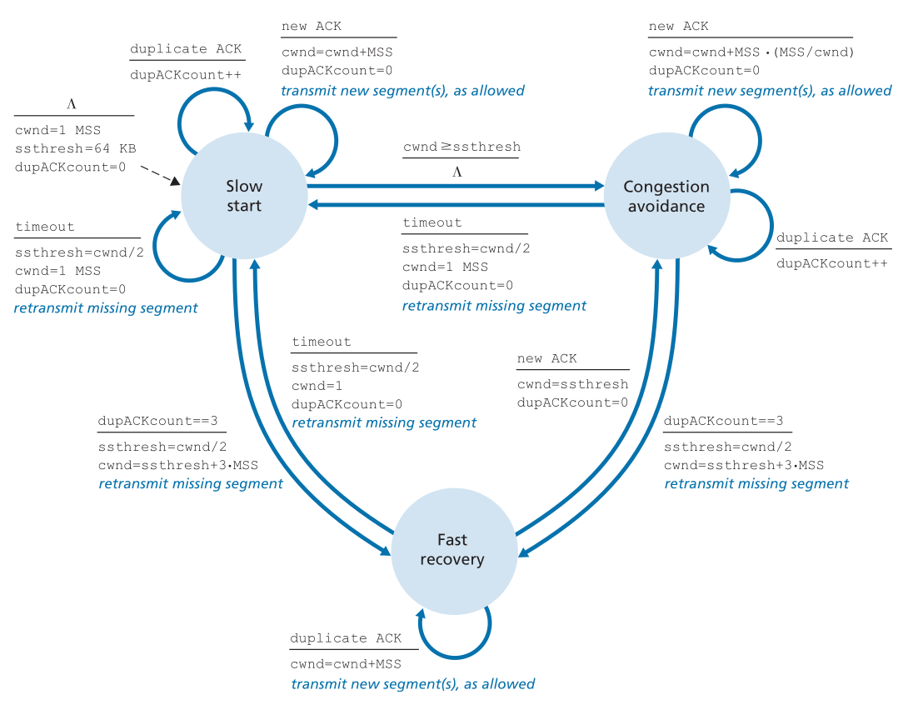

[toc]

# Chapter 1: Computer Networks and the Internet

## What Is the Internet?

The **Internet** is a computer network that interconnects billions of computing devices throughout the world.
In networking jargon, every device that runs applications that use the Internet is called an **end system** or **host**.

The Internet is able to connect so many devices by having a structure that is able to span/reach every single one of them.
Thus, if an end system A wants to reach another end system B, it only needs to send its message to the Internet, which will then be responsible for delivering the message to B.
In internet jargon, a package of information sent through the internet is generally referred to as a **packet**.

Because of its inherent complexity, the rules that dictate how the Internet works must be very well standardized.
Therefore, the Internet is very reliant on **protocols**, which is defined below:
```
A protocol defines the format and the order of messages exchanged between two or
more communicating entities, as well as the actions taken on the transmission 
and/or receipt of a message or other event.
```

We can differentiate between two main sectors of the Internet:
The **network edge** establishes an interface between end systems wanting to use the Internet and the **network core**.
The network core is then responsible for forwarding a packet from a sending to a receiving end system.

## The Network Edge

### Access Network

An **access network** is the network that connects an end system to the first router (also known as the "edge router") on a route to a receiving end system.
There are several types of access networks:

- **Home Access**: DSL, Cable, FTTH, and 5G Fixed Wireless

  - **Digital Subscriber Line (DSL)**

    A residence typically obtains DSL Internet access from the same local telephone company that provides its wired local phone access.

    A home has a **DSL modem** that takes digital data and translates it for transmission over telephone wires to the **central office (CO)** of a telephone company (telco).
    The residential telephone line carries both data and traditional telephone signals simultaneously, which are encoded at different frequencies.
    At the CO, the analog signals are translated back into digital format at a **Digital Subscriber Line Access Multiplexer (DSLAM)**, and sent into the Internet.

    The DSL standards define multiple transmission rates, namely downstream and upstream. 
    These are different, which leads us to call the access **asymmetric**.
    The maximum rates are limited by the distance between the home and the CO.

  - **Cable**

    Cable Internet access makes use of a cable television company’s existing infrastructure.
    Fiber optics connect the cable head end to neighborhood-level junctions, from which traditional coaxial cable is then used to reach individual houses.
    Because both fiber and coaxial cable are employed in this system, it is often referred to as **hybrid fiber coax (HFC)**.

    Cable internet access requires special modems, called **cable modems**.
    As with a DSL modem, the cable modem is typically an external device and connects to the home PC through an Ethernet port. 
    At the cable head end, the **cable modem termination system (CMTS)** turns the analog signal sent from the cable modems in many downstream homes back into digital format.
    Cable modems divide the HFC network into two channels, a downstream and an upstream channel. 
    Access is typically asymmetric, with the downstream channel typically allocated a higher transmission rate than the upstream channel.

    One important characteristic of cable Internet access is that it is a shared **broadcast medium**: every packet sent by the head end travels downstream to every home and vice-versa.
    For this reason, if several users are simultaneously downloading a video file on the downstream channel, the actual rate at which each user receives its video file will be significantly lower than the aggregate cable downstream rate.
    On the other hand, if there are only a few active users and they are all Web surfing, then each of the users may actually receive Web pages at the full cable downstream rate, because the users will rarely request a Web page at exactly the same time.
    Because the upstream channel is also shared, a distributed multiple access protocol is needed to coordinate transmissions and avoid collisions.

  - **Fiber To The Home (FTTH)**

    FTTH is an up-and-coming technology that provides even higher speed than the aforementioned methods by providing an optical fiber path from the CO directly to the home. 
    The simplest optical distribution network is called direct fiber, with one fiber leaving the CO for each home.
    More commonly, each fiber leaving the central office is actually shared by many homes; it is not until the fiber gets relatively close to the homes that it is split into individual customer-specific fibers.

  - **5G fixed wireless**
    
    5G fixed wireless is beginning to be deployed and promises high-speed residential access, without the downside of having to install costly and failure-prone cabling from the telco's CO to the home. 
    With 5G fixed wireless, using beam-forming technology, data is sent wirelessly from a provider's base station to a modem in the home, connected to a WiFi wireless router.

- **Enterprise (and Home) Access**: Ethernet and WiFi

  On corporate and university campuses, and increasingly in home settings, a **local area network (LAN)** is used to connect an end system to the edge router.
  Ethernet is by far the most prevalent access technology, using twisted-pair copper wire to connect users to an Ethernet switch.
  The Ethernet switch, or a network of such interconnected switches, is then connected into the larger Internet.

- **Wide-Area Wireless Access**: 3G and LTE 4G and 5G

  Mobile devices employ the same wireless infrastructure used for cellular telephony to send/receive packets through a base station that is operated by a cellular network provider.
  Unlike WiFi, a user need only be within a few tens of kilometers (as opposed to a few tens of meters) of the base station.
  Telecommunications companies have made enormous investments in so-called fourth-generation (4G) wireless, which provides real-world download speeds of up to 60 Mbps.
  But even higher-speed wide-area access technologies - a fifth-generation (5G) of wide-area wireless networks - are already being deployed.

### Physical Media

Physical media fall into two categories: **guided/wired media** - waves are guided along a solid medium - and **unguided/wireless media** - waves propagate in the atmosphere and in outer space.

- **Twisted-Pair Copper Wire**

  The least expensive and most commonly used guided transmission medium is twisted-pair copper wire.
  Twisted pair consists of two insulated copper wires, each about 1mm thick, arranged in a regular spin pattern.
  Typically, a number of pairs are bundled together in a cable by wrapping the pairs in a protective shield. 
  A wire pair constitutes a single communication link. 

- **Coaxial Cable**

  Like twisted pair, coaxial cable consists of two copper conductors, but the two conductors are concentric rather than parallel.
  With this construction and special insulation and shielding, coaxial cable can achieve high data transmission rates.

- **Fiber Optics**

  An optical fiber is a thin, flexible medium that conducts pulses of light, with each pulse representing a bit.
  A single optical fiber can support tremendous bit rates. 
  They are immune to electromagnetic interference, have very low signal attenuation up to 100 kilometers, and are very hard to tap. 

  These characteristics have made fiber optics the preferred long-haul guided transmission media, particularly for overseas links.
  However, the high cost of optical devices has hindered their deployment for short-haul transport, such as in a LAN or into the home in a residential access network.

- **Terrestrial Radio Channels**

  Radio channels carry signals in the electromagnetic spectrum.
  They are an attractive medium because they require no physical wire to be installed, can penetrate walls, provide connectivity to a mobile user, and can potentially carry a signal for long distances.
  The characteristics of a radio channel depend significantly on the propagation environment and the distance over which a signal is to be carried.
   Environmental considerations determine path loss and shadow fading, multipath fading, and interference.
   Terrestrial radio channels can be broadly classified into three groups:

   - those that operate over *very short distance*: personal devices such as wireless headsets, keyboards, and medical devices operate over short distances;
   - those that operate in *local areas*, typically spanning from ten to a few hundred meters: wireless LAN technologies;
   - those that operate in the *wide area*, spanning tens of kilometers: cellular access technologies.  

- **Satellite Radio Channels**

  A communication satellite links two or more Earth-based microwave transmitter/receivers, known as ground stations.
  Two types of satellites are used in communications: **geostationary satellites (GEO)** and **low-earth orbiting (LEO)** satellites. 

  Geostationary satellites permanently remain above the same spot on Earth.
  They are placed at a huge distance from ground stations, introducing a substantial signal propagation delay.
  Nevertheless, satellite links are often used in areas without access to DSL or cable-based Internet access.
  
  LEO satellites are placed much closer to Earth.
  They rotate around Earth and may communicate with each other, as well as with ground stations.
  To provide continuous coverage to an area, many satellites need to be placed in orbit. 

## The Network Core

Between source and destination, each packet travels through communication links and **packet switches** (either **routers** or **link-layer switches**).
Packets are transmitted over each communication link at a rate equal to the full transmission rate of the link.
So, if a source end system or a packet switch is sending a packet of $L$ bits over a link with transmission rate $R$ bits/sec, then the time to transmit the packet is $L/R$ seconds.

### Packet Switching

Most packet switches use **store-and-forward transmission** at the inputs to the links.
Store-and-forward transmission means that the packet switch must receive the entire packet before it can begin to transmit the first bit of the packet onto the outbound link.

The end-to-end delay of sending $P$ packets of $L$ bytes over a path consisting of $N$ links each of rate $R$ is

$$
(N+P-1) \frac{L}{R}
$$

Each packet switch may have multiple links attached to it. 
For each attached link, the packet switch has an **output buffer** or **output queue**, which stores packets that the router is about to send into that link.  
The output buffers play a key role in packet switching.
If an arriving packet needs to be transmitted onto a link but finds the link busy with the transmission of another packet, the arriving packet must wait in the output buffer.
Thus, in addition to the store-and-forward delays, packets suffer output buffer queuing delays.
These delays are variable and depend on the level of congestion in the network.  
Since the amount of buffer space is finite, an arriving packet may find that the buffer is completely full.
In this case, **packet loss** will occur — either the arriving packet or one of the already-queued packets will be dropped.

In the Internet, every end system has an address called an **IP address**, defined by the **IP protocol**.  
When a source end system wants to send a packet to a destination end system, the source includes the destination’s IP address in the packet’s header.
Each router has a **forwarding table** that maps destination addresses to that router’s outbound links.
When a packet arrives at a router, the router examines the destination address and searches its forwarding table to direct the packet to the appropriate outbound link.

### Circuit Switching

In circuit-switched networks, the resources needed along a path (buffers, link transmission rate) to provide for communication between the end systems are reserved for the duration of the communication session between the end systems.

A circuit in a link is implemented with either **frequency-division multiplexing (FDM)** or **time-division multiplexing (TDM)**.

With FDM, the frequency spectrum of a link is divided up among the connections established across the link, with the link dedicating a frequency band to each connection.
The width of the band is called **bandwidth**.

For a TDM link, time is divided into frames of fixed duration, and each frame is divided into a fixed number of time slots.
When the network establishes a connection across a link, the network dedicates one time slot in every frame to this connection.

### Packet vs Circuit Switching

Critics of packet switching have often argued that packet switching is not suitable for real-time services because of its variable and unpredictable end-to-end delays.

Proponents of packet switching argue that (1) it offers better sharing of transmission capacity than circuit switching and (2) it is simpler, more efficient, and less costly to implement than circuit switching.

Critics of circuit switching have always argued that circuit switching is wasteful because the dedicated circuits are idle during **silent periods**. 

## The Internet as a Service

### A Network of Networks

The Internet is maintained by **Internet Service Providers (ISPs)**, who are responsible for both connecting with end systems at the network edge, and being connected between each other at the network core.

ISPs are organized in a hierarchical structure where there are **lower-tier ISPs** and **upper-tier ISPs**. 

At the lowest level there are **access ISP**, responsible for connecting end systems with the network core.
An access ISP may be a telco, but also an university or a company providing Internet access to its employees.

At the top of the hierarchy are **tier-1 ISPs** who compete between each other to provide coverage on a global scale.
These ISPs must, of course, be connected between each other (or an end system covered by one would not be able to reach an end system covered by another).
There are approximately a dozen tier-1 ISPs.

In between these two levels there are **regional ISP**, who typically cover a region.
These ISPs are necessary as it is very hard logistically or undesirable economically for a tier-1 ISP to have a presence close to each and every access ISP.
Just like there are competing tier-1 ISPs, in a given region there may be competing ISPs providing coverage.

In order to conduct profitable businesses, each ISP in a higher level must charge ISPs below them for their Internet connection.
We say the lower level ISP is a **customer**, and the higher level ISP a **provider**.
Thus, typically, regional ISPs provide access ISPs, while being provided by tier-1 ISPs: there is a customer-provider relationship at each level of the hierarchy.
Note that it is natural for a provider to define what it charges a customer in function of the amount of traffic they exchange.
To reduce costs, a pair of nearby ISPs at the same level of the hierarchy can **peer**, that is, they can directly connect their networks together.

Note that, at any level of the hierarchy, an ISP is not restrict to connect itself with ISPs in the level that is directly above: for example, an access ISP may be provided for a tier-1 ISP, or a regional ISP may be provided by another, larger, regional ISP.

Any ISP (except tier-1 ones) may also choose to **multi-home**, that is, connect to two or more provider ISPs.
This brings customer ISPs resilience to failure/congestion in a provider ISP.
When two ISPs peer, it is typically settlement-free, that is, neither ISP pays the other.

Along these same lines, a third-party company can create an **Internet Exchange Point (IXP)**, which is a meeting point where multiple ISPs can peer together.
An IXP is typically in a stand-alone building with its own switches.

Finally, **content providers** may opt to avoid being restricted to the Internet's infrastructure, and maintain their own networking infrastructure - a **content provider network**.
By creating its own network, a content provider not only reduces its payments to upper-tier ISPs, but also has greater control of how its services are ultimately delivered to end users.  
Content provider networks will try to "bypass" the upper tiers of the Internet by peering (settlement free) with lower-tier ISPs. 
However, because many access ISPs can still only be reached by transiting through tier-1 networks, they also connect to tier-1 ISPs, and pay those ISPs for the traffic exchanged.


## Performance Metrics

### Delay in Packet Switched Networks

In this section we'll analyse the various types of delay associated with the transmission of a packet from the time it reaches a router to the time it reaches the following one.

- **Processing Delay**

  Includes the time required to examine a packet’s header and determine where to direct it. 
  The processing delay can also include other factors, such as the time needed to check for bit-level errors in the packet.

- **Queuing Delay**

  At the queue, the packet experiences a queuing delay as it waits to be transmitted onto the link.
  The length of the queuing delay of a specific packet will depend on the number of queued packets.

- **Transmission Delay**

  The amount of time required to push (that is, transmit) all of a packet’s bits into the link introduces a transmission delay.

- **Propagation Delay**

  Once a bit is pushed into the link, it needs to propagate to the next router.
  The bit propagates at the propagation speed of the link, which depends on the physical medium of the link.

#### Queuing Delay and Packet Loss

Let $a$ denote the average rate at which packets arrive at the queue ($a$ is in units of packets/sec).
With transmission rate $R$ (in bits/sec) and all packets having $L$ bits, we have that the average rate at which bits arrive at the queue is $La$ bits/sec.
Finally, assume that the queue is very big, so that it can hold essentially an infinite number of bits.
The ratio $\frac{La}{R}$, called the **traffic intensity**, often plays an important role in estimating the extent of the queuing delay.

If $\frac{La}{R} > 1$, then the average rate at which bits arrive at the queue exceeds the rate at which the bits can be transmitted from the queue, forcing the queue will to increase without bound and the queuing delay to approach infinity.
Therefore, one of the golden rules in traffic engineering is: Design your system so that the traffic intensity is no greater than 1.

When $\frac{La}{R} \leq 1$, the nature of the arriving traffic impacts the queuing delay.
For example, if packets arrive periodically every packet will arrive at an empty queue and there will be no queuing delay, but if packets arrive in bursts but periodically, there can be a significant average queuing delay.

Typically, the arrival process to a queue is random.
In this more realistic case, the quantity $\frac{La}{R}$ is not usually sufficient to fully characterize the queuing delay statistics.  
Nonetheless, it is useful in gaining an intuitive understanding of the extent of the queuing delay.

In reality a queue preceding a link is not capable of holding an infinite number of packets, but has a finite capacity.
Therefore, packet delays do not approach infinity as the traffic intensity approaches 1.
Instead, a packet can arrive to find a full queue in which case a router will **drop** or **lost**.

#### End-to-End Delay

The delay over a route consisting of $N$ routers is the sum of the delay over every one of the routers.
In addition to processing, transmission, and propagation delays, there can be additional significant delays in the end systems.
For example, an end system wanting to transmit a packet into a shared medium may purposefully delay its transmission as part of its protocol for sharing the medium with other end systems.

### Throughput in Computer Networks

The **throughput** is a measure of the rate at which bits are transferred between a sender and a receiver.
The throughput of a connection will always be limited by the slowest link on the route from the sender to the receiver - this is called the **bottleneck link**.

Generally, the core of the Internet is over-provisioned with high speed links that experience little congestion, so that the rate at which bits can flow from source to destination is constrained by the access network.

## Protocol Layers and Their Service Models

To provide structure to the design of network protocols, network designers organize protocols in **layers**.
A layered architecture allows us to discuss a well-defined, specific part of a large and complex system.
This simplification is of considerable value by providing modularity, making it much easier to change the implementation of the service provided by the layer.
As long as the layer provides the same **service** to the layer above it, and uses the same services from the layer below it, the remainder of the system remains unchanged when a layer’s implementation is changed.

One potential drawback of layering is that one layer may duplicate lower-layer functionality.
A second potential drawback is that functionality at one layer may need information that is present only in another layer, which violates the goal of separation of layers.

When taken together, the protocols of the various layers are called the **protocol stack**.
The Internet protocol stack consists of five layers: the physical, link, network, and stack layers.

### Application Layer

The application layer is where network applications and their application-layer protocols reside. 
An application-layer protocol is distributed over multiple end systems, with the application in one end system using the protocol to exchange packets of information with the application in another end system.
We’ll refer to a packet of information at the application layer as a **message**.

### Transport Layer

The Internet’s transport layer transports application-layer messages between application endpoints.
In the Internet, there are two transport protocols, TCP and UDP, either of which can transport application-layer messages in transport-layer packets, called **segments**. 

### Network Layer

The Internet’s network layer is responsible for moving network-layer packets known as **datagrams** from one host to another.
The Internet transport-layer protocol (TCP or UDP) in a source host passes a transport-layer segment and a destination address to the network layer.
The network layer then provides the service of delivering the segment to the transport layer in the destination host.

The Internet’s network layer includes the IP protocol, and all Internet components that have a network layer must run the IP protocol.
It also contains routing protocols that determine the routes that datagrams take between sources and destinations.

### Link Layer

The Internet’s network layer routes a datagram through a series of routers between the source and destination.
To move a packet from one node (host or router) to the next node in the route, the network layer relies on the services of the link layer.
In particular, at each node, the network layer passes the datagram down to the link layer, which delivers the datagram to the next node along the route.
At this next node, the link layer passes the datagram up to the network layer.
Examples of link-layer protocols include Ethernet, WiFi, and the cable access network’s DOCSIS protocol.

### Physical Layer

While the job of the link layer is to move entire frames from one network element to an adjacent network element, the job of the physical layer is to move the individual bits within the frame from one node to the next.
The protocols in this layer are again link dependent and further depend on the actual transmission medium of the link.

## Encapsulation

Similar to end systems, routers and link-layer switches organize their networking hardware and software into layers.
Usually, link-layer switches implement layers 1 and 2 of the protocol stack, while routers implement layers 1 through 3, and hosts implement all five layers.

At each layer, a packet has two types of fields: header fields and a **payload field**. 
The payload is typically a packet from the layer above, reflecting the **encapsulation** of the stack protocol.

# Chapter 2: Application Layer

## Principles of Network Applications

At the core of network application development is writing programs that run on different end systems and communicate with each other over the network.
Importantly, to do so, you do not need to write software that runs on network-core devices, such as routers or link-layer switches.
Confining application software to the end systems has facilitated the rapid development and deployment of a vast array of network applications.

### Network Application Architectures

A network application consists of pairs of processes that communicate over a network.
From the application developer’s perspective, the network architecture is fixed and provides a specific set of services to applications.
The **application architecture**, on the other hand, is designed by the application developer and dictates how the application is structured over the various end systems.

The two predominant architectural paradigms used in modern network applications are:

- **Client-Server architecture**:
  There is an always-on host, called the **server**, which services requests from many other hosts, called **clients**.
  Server size needs to scale with size of application. Very big applications require data center(s) to handle the clients' requests.
- **Peer-to-Peer architecture (P2P)**:
  There is minimal (or no) reliance on dedicated servers. Instead the application exploits direct communication between pairs of intermittently connected hosts, called **peers**.
  One of the most compelling features of P2P architectures is their self-
scalability.

In the context of a communication session between a pair of processes, the process that initiates the communication is labeled as the **client**, and the process that waits to be contacted is the **server**.

In order for a process running on the client to send packets to a process running on the server, two pieces of information need to be specified: 

- The address of the server host - in the Internet, hosts are identified by **IP addresses**.
- An identifier that specifies the receiving process - an integer that we give the name **port number**. 

A process sends messages into, and receives messages from, the network through a software interface called a **socket**.
A socket is the interface between the application layer and the transport layer within a host.
In other words, it is the API between the application and the network.
The application developer has control of everything on the application-layer side of the socket but has little control of the transport-layer side of the socket.

On the application-layer side of the socket, **application-layer protocols** define how an application’s processes, running on different end systems, pass messages to each other.
In particular, an application-layer protocol defines:

- The types of messages exchanged, for example, request messages and response messages;
- The syntax of the various message types, such as the fields in the message and how the fields are delineated;
- The semantics of the fields, that is, the meaning of the information in the fields;
- Rules for determining when and how a process sends messages and responds to messages.

The only control that the application developer has on the transport-layer side is the choice of transport protocol and perhaps the ability to fix a few transport-layer parameters such as maximum buffer and maximum segment sizes.  
The choice of transport protocol and its parameters may have effects on the **reliability**, **throughput**, **security**, and **timing** of delivery of the messages.

There are two main transport layer services that the Internet provides to the application layer:

- TCP
  When an application invokes TCP as its transport protocol, the application receives **connection-oriented** service with **reliable data transfer**. 
- UDP
  UDP is a **connectionless**, **unreliable** data transfer service.

## The Web and HTTP

The **HyperText Transfer Protocol (HTTP)** is the Web’s application-layer protocol.
HTTP is implemented in two programs: a client program and a server program, executing on different end systems, who talk to each other by exchanging HTTP messages. 
HTTP defines the structure of these messages and how the client and server exchange the messages.

When a user requests a Web page, the browser sends **HTTP request messages** for the objects in the page to the server.
The server receives the requests and responds with **HTTP response messages** that contain the objects.

It is important to note that the server sends requested files to clients without storing any state information about the client.
HTTP is thus said to be a **stateless protocol**.

The HTTP protocol uses TCP.

### Persistent and Non-Persistent Connections

In many Internet applications, the client and server communicate for an extended period of time, with the client making a series of requests and the server responding to each of the requests. 
Depending on the application and on how the application is being used, the series of requests may be made back-to-back, periodically at regular intervals, or intermittently.
Consequently, the application developer needs to decide whether to make each request/response pair be sent over a separate TCP connection - **non-persistent connections** (HTTP 1.0) - or if the same TCP connection can be used for all these communications - **persistent connections** (HTTP 1.1).

Persistent connections allow time efficiency in the sending of multiple files sequentially, since they do require much less TCP connections to be established.
For every HTTP request, non-persistent connections need two trips (front and back) to the server for every request (one to establish the TCP connection, and the other for the request/response).
While these can often be done in parallel, persistent connections allow much faster response.
Namely, persistent connections allow for pipelining, where a server will send several pages to the client without waiting for its response.

It must be noted though that for every TCP connection a server has established, it must maintain its state, through TCP buffers and variables.
For a server that is serving many connections, this might be a significant overhead.

### HTTP Message Format

There are two types of HTTP messages: request messages and response messages

#### HTTP Request Message

The first line of an HTTP request message is called the **request line**, while the subsequent lines are called the header lines. 
Depending on the method used in the request message, there might be an **entity body** in the message as well.


The request line has three fields: 
- the method field; 
- the URL field;
- the HTTP version field. 

The method field can take on several different values, including:
- **GET**: 
  Used when the browser requests an object (the great majority of HTTP request).
- **HEAD**: 
  Similar to the GET method - when a server receives a request with the HEAD method, it responds with an HTTP message but it leaves out the requested object (application developers often use the HEAD method for debugging).
- **POST**: 
  Often used when the user fills out a form (for example, when a user provides search words to a search engine). 
  With a POST message, the user is still requesting a Web page from the server, but the contents of it depend on entered data.
- **PUT**:
  Often used in conjunction with Web publishing tools.
  It allows a user to upload an object to a specific path (directory) on a specific Web server.
  The PUT method is also used by applications that need to upload objects to Web servers. 
- **DELETE**: 
  Allows a user, or an application, to delete an object on a Web server.

#### HTTP Response Message

Similarly to a request message, a response message has a **status line**, some **header lines**, and a **entity body** (preceded by a blank line).


The header line has three fields:
- the HTTP version field;
- the status code field;
- the phrase field.

This status code and its associated phrase indicate the result of the request. 
A few examples are:

- **200 OK**:
  Request succeeded and the information is returned in the response.
- **301 Moved Permanently**:
  Requested object has been permanently moved.
- **400 Bad Request**:
  This is a generic error code indicating that the request could not be understood by the server.
- **404 Not Found**:
  The requested document does not exist on this server.
- **505 HTTP Version Not Supported**:
  The requested HTTP protocol version is not supported by the server.

### Cookies

As we've seen above, HTTP is a stateless protocol - the server does not keep information about a client's requests.
However, for some Web uses, this may be useful.
HTTP allows keeping track of users through **cookies**.

Cookie technology has four components: 
- A cookie header line in the HTTP response message.
- A cookie header line in the HTTP request message.
- A cookie file kept on the user’s end system and managed by the user’s browser.
- A back-end database at the Web site.

### Web Caching

A **Web cache**, also called a **proxy server**, is a network entity that satisfies HTTP requests on the behalf of an origin Web server.
Web cache has its own disk storage and keeps copies of recently requested objects in this storage.

When a browser requests an object from a server with an web cache:

1. The browser establishes a TCP connection to the Web cache and sends an HTTP request for the object to the Web cache.
2. The Web cache checks to see if it has a copy of the object stored locally.
  If it does, the Web cache returns the object within an HTTP response message to the client browser.
3. If the Web cache does not have the object, the Web cache opens a TCP connection to the origin server. 
  The Web cache then sends an HTTP request for the object into the cache-to-server TCP connection.
  After receiving this request, the origin server sends the object within an HTTP response to the Web cache.
4. When the Web cache receives the object, it stores a copy in its local storage and sends a copy, within an HTTP response message, to the client browser.

Typically a Web cache is purchased and installed by an ISP.
It has seen deployment in the Internet as it reduces both response times and traffic.

#### Conditional GET

Caching introduces however a new problem: the copy of an object residing in the cache may have been modified since the copy was cached at the client.
HTTP has a mechanism that allows a cache to verify that its objects are up to date, called the **conditional GET**.
An HTTP request message is a so-called conditional GET message if it uses the GET method and includes an "If-Modified-Since:" header line.
Upon getting this request, a web cache will request the same page from the original server, which if the page has not been modified since the specified date, will respond with a "304 Not Modified" message (and an empty entity body to save bandwidth), indicating that the web cache may return the object it has stored.

Through the use of **Content Distribution Networks (CDNs)**, Web caches are increasingly playing an important role in the Internet.
A CDN company installs many geographically distributed caches throughout the Internet, thereby localizing much of the traffic.
There are shared CDNs (such as Akamai and Limelight) and dedicated CDNs (such as Google and Netflix).

### HTTP/2

The primary goals for HTTP/2 are:

- To reduce perceived latency by enabling request and response multiplexing over a single TCP connection.
- Provide request prioritization and server push.
- Provide efficient compression of HTTP header fields.

HTTP/2 does not change HTTP methods, status codes, URLs, or header fields.
Instead, HTTP/2 changes how the data is formatted and transported between the client and server.

HTTP/2 also presents a solution to the **Head of Line (HOL) blocking problem**.
The HOL blocking problem refers to the problem of delaying small objects in an HTML base page because they are referenced in such page after some much larger object, that is taking a long time passing through a bottleneck link.

The typical solution for this problem in HTTP/1.1 is to open multiple parallel TCP connections, thereby having objects in the same web page sent in parallel to the browser.
HTTP/2, however, presents a better solution by breaking each message into small frames, and interleaving the request and response messages on the same TCP connection.
The ability to break down an HTTP message into independent frames, interleave them, and then reassemble them on the other end is the single most important enhancement of HTTP/2.

## Electronic Mail in the Internet

The Internet mail system has three major components:
- **User agents**;
- **Mail servers**;
- **Simple Mail Transfer Protocol (SMTP)**.

When a user A wants to send a message to a user B, A's user agent sends the message to her mail server, where the message is placed in the mail server’s outgoing **message queue**.
When Bob wants to read a message, his user agent retrieves the message from his **mailbox** in his mail server.
How the message goes from A's mail server to B's mail server is defined by SMTP.

SMTP uses TCP to provide reliable transfer of messages.
It is composed of three phases of transfer: **handshaking**, **transfer of messages**, and **closure**.

A Mail Message uses the following standard text message format:
- A set of header lines, which may be:
  - "From:" (mandatory)
  - "To:" (mandatory)
  - "Date:"
  - "Subject:"
  - "Received:" (added by receiving SMTP server)
- A blank line.
- The message body (in 7-bit ASCII).

Note that the mailbox of a mail receiver is on a server host, different from the users endpoint.
Therefore, the user needs a protocol to obtain any received mail from the server.  
It can't use SMTP, as it is a push protocol.
Some mail access protocols are:
- POP: Post Office Protocol
- IMAP: Internet Mail Access Protocol
- HTTP

## DNS - The Internet's Directory Service

One host is identified by a **hostname**.
Hostnames are mnemonic and are therefore appreciated by humans.
However, hostnames provide little, if any, information about the location within the Internet of the host.
Furthermore, because hostnames can consist of variable-length alphanumeric characters, they would be difficult to process by routers.
For these reasons, hosts are also identified by so-called **IP addresses**.

An IP address consists of four bytes in decimal notation, separated by periods (e.g 121.7.106.83).
It has a rigid hierarchical structure: we scan the address from left to right, and obtain more and more specific information about where the host is located in the Internet.

Because humans prefer hostnames but machines prefer IP addresses, we need a directory service that translates hostnames to IP addresses.
This is the main task of the Internet’s **domain name system (DNS)**.
The DNS is 

- A distributed database implemented in a hierarchy of DNS servers;
- An application-layer protocol that allows hosts to query the distributed database.

The DNS servers are often UNIX machines running the Berkeley Internet Name Domain (BIND) software. 

The DNS protocol runs over UDP and uses port 53.

On top of the standard translation service, DNS is also responsible for:

- **Host aliasing**:
  A host with a complicated hostname can have one or more alias names.
  The original hostname is said to be a **canonical hostname**.
- **Mail server aliasing** 
- **Load distribution**:
  Busy sites are replicated over multiple servers, each server on a different end system with a different IP address.
  For replicated Web servers, a set of IP addresses is thus associated with one alias hostname.
  The DNS database contains this set of IP addresses.
  When clients make a DNS query for a name mapped to a set of addresses, the server responds with the entire set of IP addresses, but rotates the ordering of the addresses within each reply.
  Because a client typically sends its HTTP request message to the IP address that is listed first in the set, DNS rotation distributes the traffic among the replicated servers.

## DNS Server Hierarchy

In order to deal with the issue of scale, the DNS uses a large number of servers, organized in a hierarchical fashion and distributed around the world.  
There are three classes of DNS servers, organized in a hierarchy:
- **Root DNS servers**: 
  There are more than 1000 root servers instances scattered all over the world.
  These are copies of 13 different root servers.
- **Top-level domain (TLD) DNS servers**:
  For each of the top-level domains (such as com, org, net, edu, gov, all the country codes, and others) there is a TLD server.
- **Authoritative DNS servers**:
  Every organization with publicly accessible hosts on the Internet must provide publicly accessible DNS records that map the names of those hosts to IP addresses.
  An organization can choose to implement its own authoritative DNS server to hold these records; alternatively, the organization can pay to have these records stored in an authoritative DNS server of some service provider.
  Most universities and large companies implement and maintain their own primary and secondary (backup) authoritative DNS server.

There is another important type of DNS server called the **local DNS server**, also called the **default name server**.
A local DNS server does not strictly belong to the hierarchy of servers but is nevertheless central to the DNS architecture.
Each ISP has a local DNS server, which acts as a proxy for any DNS communication between two hosts. 
When a host connects to an ISP, the ISP provides the host with the IP addresses of one or more of its local DNS servers.

## DNS Queries

DNS queries can be of two types:

- **Iterative query**: 
  If a contacted server doesn't know the mapping for the required hostname, it replies with the name of another server to contact ("I don’t know this name, but ask this server") - burden is always on the client.
- **Recursive query**: 
  If contacted server doesn't know the mapping for the required hostname, it will ask another server for it - burden on the server.

Generally, the query from the requesting host to the local DNS server is recursive, while the remaining queries are iterative.

## DNS Caching

DNS extensively exploits **DNS caching** in order to improve the delay performance and to reduce the number of DNS messages ricocheting around the Internet.
In a query chain, when a DNS server receives a DNS reply, it can cache the mapping in its local memory.
These cache entries obviously can't be kept indefinitely: they usually disappear after some time (typically 2 days).

## DNS Records

The DNS servers store **resource records (RRs)**, including RRs that provide hostname-to-IP address mappings.
Each DNS reply message carries one or more resource records.

A resource record is a four-tuple that contains the following fields: `(Name, Value, Type, TTL)`

`TTL` is the **Time To Live** of the resource record; it determines when a resource should be removed from a cache.

The meaning of `Name` and `Value` depend on Type:

- If `Type` is `A`, then `Name` is a hostname and `Value` is the IP address for the hostname. 
  Thus, a Type A record provides the standard hostname-to-IP address mapping.
- If `Type` is `NS`, then `Name` is a domain and `Value` is the hostname of an authoritative DNS server that knows how to obtain the IP addresses for hosts in the domain.
  This record is used to route DNS queries further along in the query chain.
- If `Type` is `CNAME`, then `Value` is a canonical hostname for the alias hostname `Name`.
- If `Type` is `MX`, then `Value` is the canonical name of a mail server that has an alias hostname `Name`.
  Note that by using the MX record, a company can have the same aliased name for its mail server and for one of its other servers (such as its Web server).
  To obtain the canonical name for the mail server, a DNS client would query for an `MX` record; to obtain the canonical name for the other server, the DNS client would query for the `CNAME` record. 

### Inserting Records into the DNS Database

When a new domain name is created, in order for it to be registered in the DNS, a **registrar** needs to verify it's uniqueness and enter it into the DNS database (collecting a fee for its services).
When a domain name is registered, the IP addresses of it's primary and secondary authoritative DNS servers need to be provided.
For each of these two DNS servers, the registrar would then enter into the TLD servers a Type NS and a Type A record.
The creator should then make sure that a Type A resource record for it's Web server and the Type MX resource record for it's mail server are entered into it's authoritative DNS server.

## DNS Messages

There are two kinds of DNS messages: **query** and **reply** messages, and they both have the same format:

- **Header section**: the first 12 bytes of the message.
  The header section has a number of fields:
  - The first field is a 16 bit number that identifies the query.
    This identifier is copied from a query to it's reply, allowing the client to match them.
  - The second field is the flag field.
    - 1-bit to represent the type of message: query (0) or reply (1);
    - 1-bit indicates when a DNS server is an authoritative server for a queried name;
    - 1-bit used when a client desires that the DNS server perform recursion.
    - 1-bit set in a reply if the DNS server supports recursion.
  - In the header, there are also four number-of fields. 
    These fields indicate the number of occurrences of the four types of data sections that follow the header.

- **Question section**:
  Contains information about the query that is being made.
  This section includes (1) a name field that contains the name that is being queried, and (2) a type field that indicates the type of question being asked.

- **Answer section**:
  In a reply from a DNS server, the answer section contains the resource records for the name that was originally queried.
  A reply can return multiple RRs in the answer, since a hostname can have multiple IP addresses.

- **Authority section**:
  Contains records of other authoritative servers.

- **Additional section**:
  Other helpful records.


## Dynamic DNS

Dynamic DNS is a method that allows you to notify a Domain Name Server (DNS) to change your active DNS configuration on a device such as a router or computer of its configured hostname and address.
It is most useful when your computer or network obtains a new IP address lease and you would like to dynamically associate a hostname with that address, without having to manually enter the change every time.
Since there are situations where an IP address can change, it helps to have a way of automatically updating hostnames that point to the new address every time.

## Peer-to-Peer File Distribution

In this section, we consider a very natural P2P application, namely, distributing a large file from a single server to a large number of hosts (called peers).
In client-server file distribution, the server must send a copy of the file to each of the peers - placing an enormous burden on the server and consuming a large amount of server bandwidth.
In P2P file distribution, each peer can redistribute any portion of the file it has received to any other peers, thereby assisting the server in the distribution process.

Peer-to-Peer file distribution is much more scalable than client-server file distribution.
If we assume:
- A network with abundant bandwidth in it's core;
- A server and $N$ clients which are only participating in this transition, and no other network applications, having:
  - $u_s$ upload speed for the server;
  - $u_i$ upload speed and $d_i$ download speed for each of the $N$ clients ($i \in \{1,...,n\}$);
  - a file of size $F$

Then, the **distribution time** for a client-server protocol is

$$
\max \left( \frac{NF}{u_s}, \frac{F}{d_{min}} \right)
$$

where $d_{min} = \min (d_1, ..., d_n)$ and, for the P2P protocol it is

$$
\max \left( \frac{F}{u_s}, \frac{F}{d_{min}}, \frac{NF}{u_s + \sum_{i=1}^N u_i} \right)
$$

# Chapter 3: Transport Layer

A transport-layer protocol provides for **logical communication** between application processes running on different hosts - that is, from an application’s perspective, it is as if the hosts running the processes were directly connected.
The transport-layer is then responsible for converting application-layer messages into transport-layer **segments**.

The transport-layer's services are conditioned by the network-layer.
The Internet’s network-layer protocol has a name - IP, provides logical communication between hosts.
The IP service model is a **best-effort delivery service**. 
This means that IP makes its "best effort" to deliver segments between communicating hosts, but it makes no guarantees.
In particular, it does not guarantee:

- Segment delivery.
- Orderly delivery of segments.
- Integrity of the data in the segments.

For these reasons, IP is said to be an unreliable service.

The most fundamental responsibility of UDP and TCP is to extend IP’s delivery service between two end systems to a delivery service between two processes running on the end systems.
Extending host-to-host delivery to process-to-process delivery is called transport-layer **multiplexing** and **demultiplexing**.  
UDP and TCP also provide **integrity checking** by including error-detection fields in their segments’ headers.

These two minimal transport-layer services are the only two services that UDP provides.  
TCP, on the other hand, converts IP’s unreliable service between end systems into a reliable data transport service between processes.
TCP also provides **congestion control**.

## Multiplexing and Demultiplexing

First, we recall that a process can have one or more **sockets**, through which the communication between a process and the network is implemented.
Thus, the transport layer must actually multiplex and demultiplex between sockets, and not processes.
These sockets have a unique identifier, which corresponds to the **port number**.

UDP multiplexing and demultiplexing is very simple.
When it has to deliver an application-layer message, UDP places in the corresponding segment's header a source port number and a destination port number.
It then passes the segment on to the network-layer, which will find the destination's IP address, place it somewhere in it's datagram's header, and forward such datagram to such IP address.
Note that any socket is uniquely identified by it's IP address and it's port number.
On the receiving end, the destination host receives a segment from the network-layer and finds in it's header the socket it needs to forward the application-layer message to.

Note that, unlike an UDP socket, a TCP socket is identified by four values: the destination's IP address and port number and the source's IP address and port number.
In particular, and in contrast with UDP, two arriving TCP segments with different source IP addresses or source port numbers will be directed to two different sockets.
After a connection is established between a server and a client, the socket corresponding to that connection will be identified by those four values, and any segment with them will be matched to it.

## Connectionless Transport: UDP

UDP is a simple "bare bones" Internet transport protocol that does few more than pass application-layer messages to the network layers.
As we've seen, such a protocol must at least provide a multiplexing and demultiplexing service, and that, on top of that, UDP also provides a very simple error-checking server.
Nevertheless, UDP is an unreliable service.

It has the following advantages:

- Finer application-level **control over what data is sent**, and when;
- **No connection establishment** implies no delay on message sending;
- **No connection state** allows a server to support more active clients;
- **Small packet header overhead**.

Common applications that run over UDP are **DNS**, **SNMP**, **HTTP/3** and multimedia applications such as Internet phone, real-time video conferencing and streaming of stored audio and video.  
Often, these applications might implement reliability themselves, enjoying UDP's advantages while having more guarantees.

An UDP segment is composed of the following fields:

- An header with four fields:
  - **Source port** number
  - **Destination port** number
  - **Length** of the data field
  - **Checksum**, used for error-checking
- The **data field**, with the application message

The checksum field is obtained by splitting the segment in a sequence of 16-bit values and adding them as 16-bit integers (considering overflow).
The receiver needs to compute the checksum of the data field similarly. 
If these values differ, then there was an error (there is no procedure for recovery).

## Principles of Reliable Data Transfer

In order for them to have good performance, RDT protocols should use **pipelining**, this is, they should be able to send several packages without any guarantees that sender is receiving them (of course, this guarantee should exist at some point in time).

Two basic approaches toward pipelined error recovery can be identified: **Go-Back-N** and **selective repeat**.
These are both called **sliding window protocols** as they allow the sender to transmit up to $N$ packets without waiting for an acknowledgement.
The value $N$ is called the **window size**.

### Go-Back-N (GBN)

In a **Go-Back-N (GBN)** protocol, the sender is allowed to transmit multiple packets (when available) without waiting for an acknowledgment, but is constrained to have no more than some maximum allowable number, N, of unacknowledged packets in the pipeline.  
The receiver sends **cumulative ACKs**: if it sends an ACK with sequence number $n$, it has received every byte up to the $n$-th one.  
The sender further has a timer for the oldest unacked packet.
When the timer expires, it retransmits every unacked packet.


In our GBN protocol, the receiver discards out-of-order packets.
This makes sense as, in the GBN protocol, if a packet is lost, every packet after it will be retransmitted, therefore making buffering useless.  
This of course has the downside of consuming more of the network's bandwidth.

### Selective Repeat

**Selective repeat** protocols avoid unnecessary retransmissions by having the sender retransmit only those packets that it suspects were received in error
This individual, as-needed, retransmission will require that the receiver individually acknowledge correctly received packets.
A window size of N will again be used to limit the number of outstanding, unacknowledged packets in the pipeline.
However, unlike GBN, the sender will have already received ACKs for some of the packets in the window.

The SR receiver will acknowledge a correctly received packet whether or not it is in order.
Out-of-order packets are buffered until any missing packets are received, at which point a batch of packets can be delivered in order to the upper layer.


It is important to note that the receiver reacknowledges (rather than ignores) already received packets with certain sequence numbers below the current window base.
This is because the sender and receiver will not always have an identical view of what has been received correctly and what has not.
Particularly, if the range of numbers allowed for the sequence numbers and window size are not chosen carefully, it might happen that the receiver is not able to unambiguously decide if it is receiving a new message or an already sent one.

## Connection Oriented Transport: TCP

TCP, as a service is:
- **Connection-oriented**: 
  Two processes must "handshake" before communicating.
- **Reliable and in-order**.
- **Full-duplex**: 
  Data flow is bi-directional.
- **Point-to-point**: 
  Between a single sender and a single receiver.

### TCP Segment Structure


A brief look at the segment's fields:
- The **source and destination port numbers** are used for multiplexing/demultiplexing data from/to upper-layer applications;
- The 32-bit **sequence number** field and the 32-bit **acknowledgment number** field are used by the TCP sender and receiver in implementing a reliable data transfer service;
- The 4-bit **header length** field specifies the length of the TCP header in 32-bit words. The TCP header can be of variable length due to the TCP options field. (Typically, the options field is empty, so that the length of the typical TCP header is 20 bytes.)
- The 16-bit **receive window** field is used for flow control;
- The **checksum** field is used for error detection;
- The optional and variable-length **options** field is used when a sender and receiver negotiate the maximum segment size (MSS) or as a window scaling factor for use in high-speed networks;
- The **flag** field contains:
  - The **ACK** bit is used to indicate that the value carried in the acknowledgment field is valid;
  - The **RST**, **SYN**, and **FIN** bits are used for connection setup and teardown;
  - The **CWR** and **ECE** bits are used in explicit congestion notification;
  - The **PSH** bit indicates if the receiver should pass the data to the upper layer immediately;
  - The **URG** is used to indicate that there is data in this segment that the sending-side upper-layer entity has marked as “urgent.”

#### Sequence and Acknowledgment numbers

The *sequence number* for a segment is therefore the byte-stream *number of the first byte in the segment*.  
The *acknowledgment number* that Host A puts in its segment is the sequence *number of the next byte* Host A is expecting from Host B.  
Because TCP only acknowledges bytes up to the first missing byte in the stream, TCP is said to provide **cumulative acknowledgments**.

The TCP RFCs do not impose any rules on what a receiver should do with out-of-order received segments.
The programmer can opt between discarding such segments, or keeping them until the expected segments are received.

### TCP Connection Establishment

In order to establish a connection, TCP performs a **three-way handshake**:
1. The client-side TCP first sends a **SYN segment** to the server-side TCP (segment with the SYN bit set to 1) with a randomly chosen sequence number (`client_isn`) in the sequence number field.

2. Once the SYN segment arrives at the server host, the host allocates the TCP buffers and variables to the connection, and sends a connection-granted segment to the client TCP.
  This segment has the SYN bit set, the acknowledgment field set to `client_isn+1`, and a sequence number `server_isn` value in the sequence number field.

3. Upon receiving the SYNACK segment, the client also allocates buffers and variables to the connection.
  The client host then sends the server yet another segment, acknowledging the server’s connection-granted segment.
  The SYN bit is set to zero, and the payload field may already carry data since the connection is established.

### TCP Message Sending

Once a TCP connection is established, the two application processes can send data to each other.
To do so, the client process passes a stream of data through the socket into the connection’s **send buffer**.
From time to time, TCP will grab chunks of data from the send buffer and pass the data to the network layer.

The maximum amount of data that can be grabbed and placed in a segment is limited by the **maximum segment size (MSS)**, which in turn is limited my the **maximum transmission unit (MTU)** - the length of the largest link-layer frame that can be sent.

When TCP receives a segment at the other end, the segment’s data is placed in the TCP connection’s receive buffer.
The application reads the stream of data from this buffer.
Each side of the connection has its own send buffer and its own receive buffer.

### TCP Reliable Data Transfer

TCP creates a reliable data transfer service on top of the unreliable service offered by IP, using a **sliding window** protocol with **cumulative ACKs** and a single **retransmission timer**.

Retransmission is triggered by either a timeout event or duplicate ACKs.  
Since timeout values are often big, a sender may want to **fast retransmit** a packet, when it realizes the packet may have been lost.
Because ACKs are cumulative, if a receiver sees duplicate ACKs for the same packet, it will know the sender is receiving out-of-order packets.

If a TCP sender receives three duplicate ACKs for the same data, it takes this as an indication that the segment following the ACKed segment has been lost and immediately retransmits such packet.

#### RTT Estimation and Timeout Value

TCP estimates the RTT from sample RTT according to the formula

$$
\text{EstimatedRTT} = (1-\alpha) \cdot \text{EstimatedRTT} + \alpha \cdot \text{SampleRTT}
$$

This performs an average of the sample RTTs, giving exponentially less value to older samples.  
The value of $\alpha$ is usually set to 0.125.

TCP also has a measure of the variability of the RTT.

$$
\text{DevRTT} = (1 – \beta) \cdot \text{DevRTT} + \beta \cdot | \text{SampleRTT} – \text{EstimatedRTT} |
$$

The value of $\beta$ is usually $0.25$.

TCP determines the value for retransmission timeout interval as:

$$
\text{TimeoutInterval} = \text{EstimatedRTT} + 4 \cdot \text{DevRTT}
$$

An initial $\text{TimeoutInterval}$ value of 1 second is recommended.
Also, when a timeout occurs, the value of $\text{TimeoutInterval}$ is doubled to avoid a premature timeout occurring for a subsequent segment that will soon be acknowledged.
However, as soon as a segment is received and $\text{EstimatedRTT}$ is updated, the $\text{TimeoutInterval}$ is again computed using the formula above.

### Flow Control

TCP provides flow control by having the sender maintain a variable called the **receive window**.
Informally, the receive window is used to give the sender an idea of how much free buffer space is available at the receiver.
A sender may never send more bytes than those avaliable at the other end's buffer.

### TCP Connection Closure

When a host wants to close a TCP connection, it sends a segment with the FIN bit set.
The corresponding host sends a response with the ACK bit set, acknowledging the intention to close the connection.
It further sends a similar segment with the FIN bit set, to which the closure initiator responds with an acknowledgment as well.
After these messages are exchanged, all the resources in the two hosts are deallocated.

## Principles of Congestion Control

When thinking about congestion control, one should be aware of:

- The throughput of communication can never exceed the capacity at each point in the route.
- As the throughput reaches capacity, the delay of messages will increase indefinitely, as packets get stuck in long queues.
- Loss and consequent retransmission of packets further decreases the effective throughput - namely, unnecessary duplications (due to delays higher than the timeout value) are particularly harmful.
- A single point of failure (say, a single router performing high loads of work) may put to waste the rest of the network's work.

There are two broad approaches to congestion control:
- **End-to-end congestion control**: 
  The network layer provides no explicit support to the transport layer for congestion-control purposes.
  In this approach, congestion measures must be inferred from end-system observed loss and delay.
- **Network-assisted congestion control**:
  Routers provide explicit feedback to the sender and/or receiver regarding the congestion state of the network.

## TCP Congestion Control

### Classic TCP Congestion Control

TCP limits a sender's rate by having a variable, the **congestion window** (`cwnd`), that limits the amount of unacknowledged bytes that a client might send into the network (limitting the client's sending rate at $\frac{\text{cwnd}}{\text{RTT}}$).
The value of `cwnd` is adjusted by the sender in function of the perceived network congestion.

TCP uses the following guiding principles:

- A lost segment implies congestion, and hence, the TCP sender’s rate should be decreased when a segment is lost.
  TCP defines a **loss event** as segment that is not ACKed before a timeout, or is ACKed three consecutive times.
- An acknowledged segment indicates that the network is delivering the sender’s segments to the receiver, and hence, the sender’s rate can be increased.
  TCP is said to be **self-clocking** since it uses acknowledgments to trigger (or clock) its increase in congestion window size.
- Bandwidth probing: The TCP sender increases its transmission rate to probe for the rate that at which congestion is felt, backs off from that rate, and then to begins probing again to see if the congestion onset rate has changed.

#### Slow Start

When a TCP connection begins, the value of `cwnd` is typically initialized to a small value of 1 MSS, resulting in an initial sending rate of roughly $\text{MSS}/\text{RTT}$.
Since the available bandwidth to the TCP sender may be much larger than this, the TCP sender would like to find the amount of available bandwidth quickly.

Thus, in the slow-start state, the value of `cwnd` begins at 1 MSS and increases by 1 MSS every time a transmitted segment is first acknowledged.
This process results in a doubling of the sending rate every RTT.

When the sender registers a loss event, it cannot keep doubling the congestion window value:
- If the sender registers a *timeout*, it restarts the slow start process, setting `cwnd` to 1.
  It also sets the value of a second state variable, `ssthresh` (short-hand for “slow start threshold”) to `cwnd/2`.
- If the sender registers a *triple ACK*, it moves into congestion avoidance mode.

#### Congestion Avoidance

A common approach for congestion avoidance is for the TCP sender to increase `cwnd` by MSS bytes every time it receives an ACK.
This linear increase stops in the same way as the slow-start phase.
However, for triple-ACK loss events, it does not remain in congestion avoidance mode: it sets `cwnd` and `ssthresh` to `cwnd/2` and moves into fast-recovery state.

#### Fast Recovery

In fast recovery, the value of `cwnd` is increased by 1 MSS for every duplicate ACK received for the missing segment that caused TCP to enter the fast-recovery state.
Eventually, when an ACK arrives for the missing segment, TCP enters the congestion-avoidance state after deflating `cwnd`.

If a timeout event occurs, fast recovery transitions to the slow-start state after performing the same actions as in slow start and congestion avoidance: The value of `cwnd` is set to 1 MSS, and the value of `ssthresh` is set to half the value of `cwnd` when the loss event occurred.

Fast recovery is a recommended, but not required, component of TCP.

#### Retrospective

Given the aforementioned, we can represent TCP's congestion control algorithm as a finite state machine:



Ignoring the initial slow-start period, consists of linear (additive) increase in `cwnd` and then a halving (multiplicative decrease) of `cwnd` on a triple duplicate-ACK event.
For this reason, TCP congestion control is often referred to as an **additive-increase, multiplicative-decrease (AIMD)** form of congestion control.

#### TCP Cubic

TCP Cubic is a response to the observation that, assuming that a network's congestion remains relatively stable, halving the congestion window and starting cautiously probing for the congestion threshold might not be the best way of probing.
TCP Cubic thus proposes an algorithm that increases the value of `cwnd` faster when it is far from the sending rate at which congestion loss was last detected, and slower when those values are not too far apart.

### Network-Assisted TCP Congestion Avoidance

#### Explicit Congestion Notification

**Explicit Congestion Notification (ECN)** is the form of network-assisted congestion control performed within the Internet, which involves both TCP and IP.
At the network layer, two bits in the Type of Service field of the IP datagram header are used for ECN.

#### Delay-based Congestion Control

In TCP Vegas, the sender measures the RTT of the source-to-destination path for all acknowledged packets.

Let $RTT_{min}$ be the minimum of these measurements at a sender - the throughput that would be experienced in a near uncongested network.
In such a network, the throughput would be $\frac{\text{cwnd}}{RTT_{min}}$.

This version of TCP thus opts to increase `cwnd` linearly when the measured throughput is close to uncongested throughput, and decrease it linearly when it is far below it.

TCP Vegas operates under the intuition that TCP senders should "Keep the pipe just full, but no fuller".

#### Fairness

We say a congestion control mechanism is **fair** if the average transmission rate of each of $K$ different connections is approximately $R/K$ ($R$ is the transmission rate of the network's bottleneck link).
In an idealized scenario where we assume there is no UDP traffic and every TCP connection is sending a big file, it can be proven that TCP does converge to a fair state. 

In practice, these conditions are typically not met, and client-server applications can thus obtain very unequal portions of link bandwidth.
In particular, it has been shown that when multiple connections share a common bottleneck, those sessions with a smaller RTT are able to grab the available bandwidth at that link more quickly as it becomes free and thus will enjoy higher throughput.

Furthermore, UDP does not employ any kind of congestion control mechanism, thus not cooperating with TCP connections in order to maintain an uncongested network.
A number of congestion-control mechanisms have been proposed for the Internet that prevent UDP traffic from bringing the Internet’s throughput to a grinding halt

Finally, even if UDP was to act perfectly fair, the fairness problem would still be unsolved, as a single process could start several TCP connections in order to use as much throughput as possible.

## QUIC: Quick UDP Internet Connections

QUIC is a new application-layer protocol designed from the ground up to improve the performance of transport-layer services for secure HTTP.
QUIC, using UDP as its underlying transport-layer protocol, is designed to interface above specifically to a simplified but evolved version of HTTP/2. 
In the near future, HTTP/3 will natively incorporate QUIC.
Some of its major features include:

- **Connection-Oriented and Secure**;
- **Streams**: 
  Multiple application-level “streams” multiplexed over single QUIC connection
  A stream is an abstraction for the reliable, in-order bi-directional delivery of data between two QUIC endpoints.
- **Reliable, TCP-friendly congestion-controlled data transfer**

By incorporating so many features, QUIC allow to establish reliable, congestion controlled, authenticated, and secure connections in just one shake, in contrast with having one TCP handshake for reliability and congestion control, and a TLS handshake for authentication and security.
QUIC thus is able to establish connections much faster.

# Chapter 4: The Network Layer

The **Network Layer** is responsible for transporting segments from sending to receiving host.  
The sending side encapsulates transport layer segments into **datagrams**, and the receiving side extracts such segments and delivers it to the transport layer.  
Network layer protocols are implemented in *every host and router*.

The Network Layer can be split into two interacting parts:

- The **data plane** determines the *per-router* functions in the network layer that determine how a datagram moves from a router's **input link** to it's **output link**. This is called **forwarding**.
- The **control plane** determines the *network-wide* logic that controls how a datagram is routed among routers along an end-to-end path from the source host to the destination host. This is called **routing**.

A key element in every network router is its **forwarding table**.
A router forwards a packet by examining the value of one or more fields in the arriving packet’s header, and then using these header values to index into its forwarding table.
The value stored in the forwarding table entry for those values indicates the outgoing link interface at that router to which that packet is to be forwarded.

The content of a forwarding table is determined by the routing algorithm.  
Traditionally, a routing algorithm would run on every single router and it would communicate with other router's algorithm.  
Alternatively, **Software-Defined Networking (SDN)** is often used, where a **remote controller** determines a routing algorithm, and communicates it to the routers, distributing forwarding tables.

## The Internet Protocol (IP)

### IPv4 Datagram

The key fields in the IPv4 datagram are the following:
- **Version number**: 
  Specify the IP protocol in use, allowing the router to determine how to interpret the remainder of the IP datagram.
- **Header length**:
  Because an IPv4 datagram can contain a variable number of options, 4 bits are needed to determine where the payload actually begins.
- **Type of service**:
  Allow different types of IP datagrams to be distinguished from each other (for example, real-time datagrams from non-real-time traffic).
- **Datagram length**:
  Total length of the IP datagram (header plus data), measured in bytes.
  Since this field is 16 bits long, the theoretical maximum size of the IP datagram is 65,535 bytes.
  However, datagrams are rarely larger than 1500 bytes.
- **Identifier, flags, fragmentation offset**:
  These three fields have to do with so-called IP fragmentation, when a large IP datagram is broken into several smaller IP datagrams which are then forwarded independently to the destination, where they are reassembled.
- **Time-to-live**:
  Used to ensure that datagrams do not circulate forever in the network.
  This field is decremented by one each time the datagram is processed by a router, being dropped if it reaches 0.
- **Protocol**:
  Indicates the specific transport-layer protocol to which the data portion of this IP datagram should be passed.
- **Header checksum**:
  Aids a router in detecting bit errors in a received IP datagram.
- **Source and destination IP addresses**.
- **Options**:
  Allow an IP header to be extended.
  Header options were meant to be used rarely - hence the decision to save overhead by not including the information in options fields in every datagram header.
  However, the mere existence of options does complicate matters - since datagram headers can be of variable length, one cannot determine a priori where the data field will start.
  Also, since some datagrams may require options processing and others may not, the amount of time needed to process an IP datagram at a router can vary greatly.
  These considerations become particularly important for IP processing in high-performance routers and hosts.
- **Data (payload)**.


#### Fragmentation

The size of a data link frame is limited by a value, known as the **maximum transmission Unit (MTU)**.
Therefore, frequently, large transport-layer segments may need to be **fragmented** into smaller chunks in order to be sent down to the link layer.  
Moreover, each network may have a different MTU value.
Therefore, it's necessary that a datagram may be fragmented when needed.

The solution presented by IP is to keep a fragmentation offset that indicates the number of the previous fragment's bytes.
In order to allow addressing of the whole spectre of possible datagram length values with only 13 bits, the fragmentation field registers bytes in multiples of $8 = 2^3$.

With the fragmentation offsets and the length of the payload, a receiver can easily reassemble the original segment.

### IPv4 Addressing

Each IP address is 32 bits (4 bytes) long, meaning that there are $2^{32}$ possible IP addresses.
These addresses are typically written in so-called dotted-decimal notation (for example 192.168.80.30).

Every **interface** (connection between host/router and physical link) on every host and router in the global Internet must have an IP address that is globally unique.
That means, for example, that a router has several IP addresses associated with it.
This makes sense as the router's function is to allow hosts on different **subnets** (also called an IP network or simply network) to communicate.  
A subnet is a set of device interfaces that can physically reach each other without passing through a router.
These are assigned an address, sometimes known as a **subnet mask**, of the form a.b.c.d/x where the /x indicates that the leftmost x bits of the IP address shall be the same for every host on that subnet.

The Internet’s address assignment strategy is known as **Classless Interdomain Routing (CIDR)**, which generalizes the notion of subnet addressing.
As with subnet addressing, the 32-bit IP address is divided into two parts and again has the dotted-decimal form a.b.c.d/x, where x indicates the number of bits in the first part of the address.
The x most significant bits of an address of the form a.b.c.d/x constitute the network portion of the IP address, and are often referred to as the **prefix** or **network prefix** of the address.
IP addresses of devices within the organization will share the common prefix.  
The remaining 32-x bits of an address can be thought of as distinguishing among the devices within the organization, all of which have the same network prefix. 
These are the bits that will be considered when forwarding packets at routers within the organization.

A router outside the organization's ISP need not know that a message is destined to such organization.
Therefore, it can use only the prefix to redirect the message to the ISP's network.
This ability to use a single prefix to advertise multiple networks is often referred to as **address aggregation** (also **route aggregation** or **route summarization**).

Note that getting an IP address from an ISP means that, if an organization wants to change ISP, it needs to change IP.
Actually, this problem is circumvented by informing the organization's new ISP to advertise the organization's subnet (on top of it's own IP).
For this solution to work, every router must always *opt for the most specific subnet on it's forwarding table*.

Before CIDR was adopted, the network portions of an IP address were constrained
to be 8, 16, or 24 bits in length, an addressing scheme known as **classful addressing**.

An organization can obtain a block of IP addresses for use within an organization’s subnet by contacting it's ISP, which would provide addresses from a larger block of addresses that had already been allocated to the ISP.  
The ISPs themselves obtain their address blocks from the **Internet Corporation for Assigned Names and Numbers (ICANN)**.
The role of the ICANN is to:

- Allocate IP addresses.
- Manage DNS root servers.
- Assigning domain names and resolving domain name disputes.

### ICMP: The Internet Control Message Protocol

The Internet Control Message Protocol (ICMP) is used by hosts and routers to communicate network-layer information to each other.  
The most typical use of ICMP is for error reporting.  
ICMP is often considered part of IP, but architecturally it lies just above IP, as ICMP messages are carried inside IP datagrams.
ICMP messages have a type and a code field, and contain the header and the first 8 bytes of the IP datagram that caused the ICMP message to be generated.

## DHCP: Dynamic Host Configuration Protocol

Once an organization has obtained a block of addresses, it can assign individual IP addresses to the host and router interfaces in its organization.
A system administrator will typically manually configure the IP addresses into the router.
Host addresses can also be configured manually, but typically this is done using the **Dynamic Host Configuration Protocol (DHCP)**.

DHCP allows a host to obtain (be allocated) an IP address automatically.
A network administrator can configure DHCP so that a given host receives the same IP address each time it connects to the network, or a host may be assigned a temporary IP address that will be different each time the host connects to the network.

Because of DHCP’s ability to automate the network-related aspects of connecting a host into a network, it is often referred to as a **plug-and-play** or **zeroconf** (zero-configuration) protocol. 
This capability makes it very attractive to the network administrator who would otherwise have to perform these tasks manually.
DHCP is also enjoying widespread use in networks where hosts join and leave the network frequently.

DHCP is a client-server protocol.
A client is typically a newly arriving host wanting to obtain network configuration information, including an IP address for itself.
In the simplest case, each subnet will have a DHCP server.
If no server is present on the subnet, a DHCP relay agent (typically a router) that knows the address of a DHCP server for that network is needed.

Obtaining an IP address through DHCP is a 4-step process:

- Host sends a **DHCP discover** message, to find a DHCP server.
- DHCP responds with a **DHCP offer** message, where it provides the host with an IP address that it can use.
- Host requests such IP address through a **DHCP request** message.
- DHCP server confirms that the host can start using such IP address through a **DHCP ACK** message.

Every of the aforementioned DHCP are broadcasted.

On the DHCP offer message, the DHCP server includes a **lease time** - the amount of time that the host is allowed to use that IP address.  
If, after some time, the host wants to keep using the IP address, it can renew it.
For this, the host only needs to send the DHCP request message, to which the server will reply with DHCP ACK, informing the client that it's lease has been extended.  
The client should try and renew it's lease after 50% of the lease time has passed (T1 time). 
If this first time, it should try again after 85% of the lease time has passed (T2 time).
When the lease time expires, the client should stop using the leased address.

It is important to note that DHCP is an **application layer protocol**.

## Network Address Translation (NAT)

With the proliferation of small office subnets, it would seem that whenever one of these wants to install a LAN to connect multiple machines, a range of addresses would need to be allocated by the ISP to cover all IP devices.
If the subnet grew bigger, a larger block of addresses would have to be allocated.  
**Network Address Translation (NAT)**, however, provides a simple solution to assign IP addresses inside a private subnet.

NAT works by assigning to all interfaces within a private network an address with the subnet mask 10.0.0.0/24. 
The address space 10.0.0.0/8 is reserved for **private networks**, and thus, every IP address with this mask will only make sense within a host's subnet.

The NAT-enabled router does not look like a router to the outside world.
Instead the NAT router behaves to the outside world as a single device with a single IP address.
Whenever a host with a private address wants to send a message to outside it's subnet, it sends such message to the router, that masks the message behind it's IP address.
The router can also forward packets arriving to the correct hosts by using a **NAT translation table** and including port numbers and IP addresses in the table entries.

NAT is controversial because it:

- Is a network layer protocol and changes information on the transport layer, such as port numbers.
- Violates end-to-end principle, as an application designer might need to take NAT into account when designing it's application.
  For example, server processes wait for incoming requests at well-known port numbers and peers in a P2P protocol need to accept incoming connections when acting as servers.
  Technical solutions to these problems include **NAT traversal** tools.

### IPv6

In the early 1990s, the Internet Engineering Task Force began an effort to develop a successor to the IPv4 protocol.  
A prime motivation for this effort was the realization that the 32-bit IPv4 address space was beginning to be used up.
To respond to this need for a large IP address space, a new IP protocol, IPv6, was developed.
The designers of IPv6 also took this opportunity to tweak and augment other aspects of IPv4, based on the accumulated operational experience with IPv4.

The most important changes introduced in IPv6 are:

- **Expanded addressing capabilities**: 
  IP address size increases from 32 to 128 bits.
- **A streamlined 40-byte header**: 
  A number of IPv4 fields have been dropped or made optional.
  The resulting 40-byte fixed-length header allows for faster processing of the IP datagram by a router.
- **Flow labeling**: 
  “labeling of packets belonging to particular flows for which the sender requests special handling, such as a non-default quality of service or real-time service.”

The IPv6 datagram contains the following fields:

- **Version**:
  4-bit field identifies the IP version number.
- **Traffic class**:
  8-bit traffic class field, like the TOS field in IPv4, can be used to give priority to certain datagrams.
- **Next header**:
  Identifies the protocol to which the contents of this datagram will be delivered (for example, to TCP or UDP).
- **Hop limit**: 
  Like TTL, the contents of this field are decremented by one by each router that forwards the datagram.
  If the hop limit count reaches zero, a router must discard that datagram.
- **Source and destination addresses**.
- **Data**.


We highlight that the following fields disappeared from IPv4 to IPv6:

- **Fragmentation/reassembly**:
  IPv6 does not allow for fragmentation and reassembly at intermediate routers - these operations can be performed only by the source and destination.
  If an IPv6 datagram received by a router is too large the router simply drops the datagram and sends a "Packet Too Big" ICMP error message back to the sender.
  Removing this functionality from the routers and placing it squarely in the end systems considerably speeds up IP forwarding within the network.

- **Header checksum**:
  Because the transport-layer and link-layer protocols in the Internet layers perform checksumming, the designers of IP probably felt that this functionality was sufficiently redundant in the network layer that it could be removed.
  Once again, fast processing of IP packets was a central concern.

- **Options**: 
  An options field is no longer a part of the standard IP header.
  However, it has not gone away.
  Instead, the options field is one of the possible next headers pointed to from within the IPv6 header.
  That is, just as TCP or UDP protocol headers can be the next header within an IP packet, so too can an options field.
  The removal of the options field results in a fixed-length, 40-byte IP header.

#### Transitioning from IPv4 to IPv6

How can the public Internet, which is based on IPv4, be transitioned to IPv6?
The problem is that while new IPv6-capable systems can be made backward-compatible, that is, can send, route, and receive IPv4 datagrams, already deployed IPv4-capable systems are not capable of handling IPv6 datagrams.  
One option would be to declare a flag day - a given time and date when all Internet machines would be turned off and upgraded from IPv4 to IPv6.
This is impossible on an Internet with billions of connected devices.
Another solution would be to translate IPv6 headers to IPv4 headers, but this would imply some loss of information.

The approach to IPv4-to-IPv6 transition that has been most widely adopted in practice involves **tunneling**.
Assume that we want to send an IPv6 datagram between to IPv6 supporting nodes, through a set of IPv4 routers, which we refer to as the **tunnel**.
A solution is to just take the IPv6 datagram, encapsulate it with a IPv4 header, and send it through the tunnel.

## Routing Algorithms

A routing algorithm is often looking for the **least-cost path** from a host to another on the network graph.
This graph has the network's routers as vertices and the physical links between routers as edges.
The cost of an edge depends on the task that we want to perform.
It might for example, depend bandwidth, delay time, monetary cost, etc.

A routing algorithm might be:

- **Centralized** or **Global**: 
  The algorithm takes the connectivity between all nodes and all link costs as inputs.
  The calculation can be run at one site or replicated in every router.

- **Decentralized**: 
  The calculation of the least-cost path is carried out in an iterative, distributed manner by the routers.
  No node has complete information about the costs of all network links.
  Instead, each node begins with only the knowledge of the costs of its own directly attached links.
  Then, through an iterative process of calculation and exchange of information with its neighboring nodes, a node gradually calculates the least-cost path to a destination or set of destinations.

A routing algorithm can also be classified as:

- **Static**: 
  Routes change very slowly over time, often as a result of human intervention.

- **Dynamic**:
  The routing paths change as the network traffic loads or topology change.
  While dynamic algorithms are more responsive to network changes, they are also more susceptible to problems such as routing loops and route oscillation.

 Finally, we also differentiate between algorithms that are:

 - **Load-sensitive**:
  Link costs vary dynamically to reflect the current level of congestion in the underlying link.

 - **Load-insensitive**:
  A link’s cost does not explicitly reflect its current (or recent past) level of congestion.

### Link State (LS) Routing Algorithm

The **Link State (LS)** routing algorithm is a centralized algorithm, where every node obtains information about the network's topology by having each node broadcast link-state packets (LSP) to it.
This algorithm then uses Dijkstra's algorithm to compute the least-cost path from the source node to every other node.

### Distance Vector (DV) Routing Algorithm

The **Distance Vector (DV)** routing algorithm is a decentralized algorithm.
It is:

- **Distributed**:
  Each node receives some information from one or more of its directly attached neighbors, performs a calculation, and then distributes the results of its calculation back to its neighbors.

- **Iterative**: 
  The algorithm goes on until no more information is exchanged between neighbors.

- **Asynchronous**:
  It does not require all of the nodes to operate in lockstep with each other.

It consists on an application of the Bellman-Ford algorithm to the network graph.

It is important to pay attention to the **count-to-infinity** problem.
In de distance vector tables of each node, there is a column for each neighbour of such node.
Now, the best route from a node A through a node B to a node C, may be by going back to B (A->B->A->C, for example).
Now suppose the cost the link between A and C is significantly increased, such that A is convinced that routing through B is the best option (again, this "best" route is believed to be A->B->A->C).
B, still believes that the best route is through A, thus directs packets there.
The routing of packets in this link thus gets caught in a loop, which (depending on the cost of the A-B link), may be slow to catch up with the increase of the A-C link.

A solution for this problem is adding **poised reverse**.
The idea is simple - if A routes through B to get to destination C, then A will advertise to B that its distance to C is infinity.
This prevents nodes from "sending back packets", but does not present any solution for loops of more than two nodes.

### Comparison of LS and DV

We observe the following differences:

- Message complexity:
  The LS algorithm requires $O(NE)$ messages to be sent (every node must broadcast it's forwarding table), while the DV algorithm only requires exchanges between neighbours.

- Speed of Convergence:
  The LS algorithm converges in $O(N^2)$ while the DV algorithm's convergence time varies (may temporarily have routing loops and suffers from the count to infinity problem).

- Robustness: 
  The LS algorithm is more robust, as each node only calculates the cost of a link, making failures more isolated.
  The DV algorithm, however, computes path's costs, meaning that errors can propagate through the network.

## Routing in the Internet

### Hierarchical Routing

The above algorithms viewed the network was a collection of connected indistinguishable routers.
However, this model is impractical for two important reasons: 

- **Scale**:
  With hundreds of millions of routers in the internet, the above algorithms would require enormous amounts of time and memory to work.

- **Administrative autonomy**:
  Each ISP generally wants to operate its network as it pleases, or to hide aspects of its network's internal organization from the outside.

Both of these problems can be solved by organizing routers into **autonomous systems (ASs)**, with each AS consisting of a group of routers that are under the same administrative control.
Often the routers in an ISP, and the links that interconnect them, constitute a single AS but some ISPs partition their network into multiple ASs.
Every router in the same AS runs the same **intra-autonomous system routing protocol**, and has a **gateway router** that is responsible for directing links to routers in other ASs.

Hierarchical routing thus works as follows:
When a host wants to send a message to another host, it sends the message to the AS, who then forwards it to the destination network, who can finally reach the destination host.

With hierarchical routing, the forwarding tables can be considerably smaller, and their values must be configured by both intra- and inter-AS routing algorithms.  
Namely, when an AS receives a datagram with a destination outside its scope, it needs to figure out.
In order to do so, the AS needs an inter-AS routing protocol to be aware of "its surroundings".

### Intra-AS Routing

Intra-AS routing protocols are also known as **Interior Gateway Protocols (IGP)**. 
The most common ones are:

- **RIP**: Routing Information Protocol.
- **OSPF**: Open Shortest Path First.
- **IGRP**: Interior Gateway Routing Protocol (Cisco proprietary).

#### Routing Information Protocol (RIP)

The RIP is a DV algorithm that uses the number of hops (routers along the way) as the distance metric, setting a maximum distance of 15 hops for any message.  
The routers exchange distance vectors every 30 seconds, via response messages, also called **advertisement**.
Each advertisement lists up to 25 destination subnets within the AS.  
If no advertisement is heard from a router after 180 seconds, it's declared dead and any route via such router is invalidated.
The remaining nodes (starting by the dead node's neighbours) start advertising the event, and eventually the link failure propagates to the entire network.

#### Open Shortest Path First (OSPF)

OSPF is a link-state protocol that uses flooding of link-state information and a Dijkstra’s least-cost path algorithm.
With OSPF, each router constructs a complete topological map (that is, a graph) of the entire autonomous system.
Each router then locally runs Dijkstra’s shortest-path algorithm to determine a shortest-path tree to all subnets, with itself as the root node.

With OSPF, a router broadcasts routing information to all other routers in the autonomous system, not just to its neighboring routers.
A router broadcasts link-state information whenever there is a change in a link’s state or periodically, even if the link’s state has not changed.  
OSPF advertisements are contained in OSPF messages that are carried directly by IP.
Thus, the OSPF protocol must itself implement functionality such as reliable message transfer and link-state broadcast.

OSPF offers the following features:

- **Security**:
  All OSPF messages are authenticated, preventing malicious intrusion.

- **Multiple same-cost paths**:
  OSPF allows multiple same-cost paths to be chosen.

- **Integrated support for unicast and multicast routing**:
  Multicast OSPF (MOSPF) provides simple extensions to OSPF to provide for multicast routing.

- **Support for hierarchy within a single AS**:
  An OSPF autonomous system can be configured hierarchically into areas.
  Each area runs its own OSPF link-state routing algorithm, with each router in an area broadcasting its link state to all other routers in that area.
  Within each area, one or more area border routers are responsible for routing packets outside the area.  
  Exactly one OSPF area in the AS is configured to be the backbone area.
  The primary role of the backbone area is to route traffic between the other areas in the AS.
  The backbone always contains all area border routers in the AS and may contain non-border routers as well.
  Inter-area routing within the AS requires that the packet be first routed to an area border router (intra-area routing), then routed through the backbone to the area border router that is in the destination area, and then routed to the final destination.

### Inter-AS Routing and Border Gateway Protocol (BGP)

In order for devices on multiple AS to communicate, the entire Internet must use the same **inter-autonomous system routing protocol**.
In the current Internet, the protocol used is known as the **Border Gateway Protocol (BGP)**.

As an inter-AS routing protocol, BGP provides each router a means to:

- Obtain prefix reachability information from neighboring ASs.
- Determine the "best" routes to the prefixes.

For each AS, each router is either a gateway router or an internal router.

In BGP, pairs of routers exchange routing information over semi-permanent TCP connections.
Each such TCP connection, along with all the **BGP messages** sent over the connection, is called a **BGP connection**.  
Furthermore, a BGP connection that spans two ASs is called an **external BGP (eBGP)** connection, and a BGP session between routers in the same AS is called an **internal BGP (iBGP)** connection.
There is typically one eBGP connection for each link that directly connects gateway routers in different ASs.  
Note that iBGP connections do not always correspond to physical links.

BGP messages can be of the following types:

- **OPEN**: 
  Opens TCP connection to remote BGP peer and authenticates sending BGP peer.
- **UPDATE**: 
  Advertises new path (or withdraws old).
- **KEEPALIVE**: 
  Keeps connection alive in absence of UPDATES. 
  Also ACKs OPEN request.
- **NOTIFICATION**: 
  Reports errors in previous messages or closes connection.

When a router advertises a prefix across a BGP connection, it includes with the prefix several **BGP attributes**.
In BGP jargon, a prefix along with its attributes is called a **route**.
Two of the more important attributes are:
- **AS-PATH**:
  Contains the list of ASs through which the advertisement has passed.
  To generate the AS-PATH value, when a prefix is passed to an AS, the AS adds its ASN to the existing list in the AS-PATH.
  BGP routers also use the AS-PATH attribute to detect and prevent looping advertisements.
- **NEXT-HOP**:
  The IP address of the router interface that begins the AS-PATH.

#### Hot Potato Routing

In hot potato routing, the route chosen is that route with the least cost to the NEXT-HOP router beginning that route.
Therefore, the steps for adding an outside-AS prefix in a router’s forwarding table are the following:
- Learn from inter-AS protocol that subnet x is reachable via multiple gateways.
- Use routing info from intra-AS protocol to determine costs of least-cost paths to each of the gateways.
- Hot potato routing: Choose the gateway that has the smallest least cost.
- Determine from forwarding table the interface I that leads to least-cost gateway. Enter (x,I) in forwarding table.

#### Route-Selection Algorithm

In practice, BGP uses an algorithm that is more complicated than hot potato routing, but nevertheless incorporates hot potato routing.  
For any given destination prefix, the input into BGP’s route-selection algorithm is the set of all routes to that prefix that have been learned and accepted by the router.
If there are two or more routes to the same prefix, then BGP sequentially invokes the following elimination rules until one route remains:
1. A route is assigned a local preference value as one of its attributes. The value of the local preference attribute is a policy decision that is left entirely up to the AS’s network administrator. The routes with the highest local preference values remain.
2. The routes with the shortest AS-PATH are selected. If this were the only rule for selection, then BGP would be using a DV algorithm where the distance metric uses the number of AS hops.
3. Hot potato routing is used, that is, the routes with the closest NEXT-HOP router are selected.
4. If more than one route still remains, the router uses BGP identifiers to select the route.

Note that an ISP might not be incentivized to advertise certain routes, as other ISPs could use that information to route their traffic through the competition, saving bandwidth.
This is why company policy is the first criteria for route selection.
Typically, any traffic flowing across an ISP’s backbone network must have either a source or a destination (or both) in a network that is a customer of that ISP.

### Anycast, Broadcast, and Multicast Routing

#### IP-Anycast

In many applications, we are interested in 
- Replicating the same content on different servers in many different dispersed geographical locations.
- Having each user access the content from the server that is closest.

BGP’s route-selection algorithm provides an easy and natural mechanism for doing so.  
During the IP-anycast configuration stage, an entity with multiple servers can assign the same IP address to each of its servers, and uses standard BGP to advertise this IP address from each of the servers.  
When a BGP router receives multiple route advertisements for this IP address, it treats these advertisements as providing different paths to the same physical location (when, in fact, the advertisements are for different paths to different physical locations).
When configuring its routing table, each router will locally use the BGP route-selection algorithm to pick the “best” route to that IP address.

CDNs generally choose not to use IP-anycast because BGP routing changes can result in different packets of the same TCP connection arriving at different instances of the Web server.
However, it is extensively used to direct DNS queries to the closest root DNS server.

#### Broadcast Routing

When a sender wants to broadcast a datagram to, say, all other nodes in a subnet, it could deliver, consequently, as many packets as there are nodes in the subnet.
However, this would be inefficient as the sender would have to determine how many nodes are in the network, and would mandate much more transmission from every node involved in the process.

In practice, what happens is that nodes **flood** broadcast packets.
This can be done in some different ways:
- **Flooding**:
  When a node receives a broadcast packet, it just sends a copy to all neighbours.
  This has the problem of leading to cycles and a lot of unnecessary transmission.
- **Controlled Flooding**:
  A node keeps track of the packet IDs it has already broadcasted, and only floods a packet if it hasn't before.
  Alternatively, a node may forward a packet only if it arrived on the shortest path from the source (thus preventing cycles).
- **Spanning Tree**:
  Organizes the network in a tree, so that no redundant packet is received by any node.

#### Multicast Routing

We say a packet is **multicasted** when it is addressed to multiple devices simultaneously.
We say that this set of devices forms a **multicast** group.

Multicasting can be done in several ways:
- Multicast emulation:
  Then sender establishes a unicast session with each of the destinations and sends the packet on each session.
- Multicast in the application layer:
  End systems build a multicast logical tree on top of the network.
- Multicast in the network layer:
  Routers build **multicast trees** and forward packets along such three.

Two components are needed for network-layer multicast in the Internet:
- A multicast group membership discovery protocol.
  In the Internet, the **Internet Group Management Protocol (IGMP)** is used for IPv4, and the **Multicast Listener Discovery (MLD)** protocol is used for IPv6.
- A multicast routing protocol.

In the Internet Group Management Protocol, all destinations in a multicast group are assigned the same IP address, on top of their own unicast IP address.  
The IGMP operates between the hosts and their edge routers, with each end system informing the corresponding router to which multicast groups it wants to belong.

Algorithms for building multicast trees can be:

- **Source-based**: 
  Every node establishes its own tree.
  Two common approaches are:

  - **Shortest Path Tree**:  
    The sending node uses Dijkstra's algorithm to establish the tree with shortest pah to all receivers.
  - **Reverse Path Forwarding**:  
    Every node floods a receiving packet if and only if it arrives on the shortest path from the source.  
    If the resulting forwarding tree contains subtrees with no mulitcast group members, downstream nodes will send upstream **"prune" messages** informing that there is no need to keep transmiting the multicast packet.

- **Group-shared**: 
  A single tree is used by the whole group, with one router identified as the center.  
  In order to join the tree, an edge router sends an unicast *join-msg* addressed to the center router.
  The intermediate routers process and forward the message towards the center.
  The route taken by this message is set as the branch of tree for this router.

An example of a multicast routing protocol in the Internet is the **Distance Vector Multicast Routing Protocol (DVMRP)**.
It uses a source-based, reverse path forwarding tree.

// TODO: PIM and stuff?

# Chapter 5: The Link Layer and LANs

In this chapter we'll refer to any device that runs a link-layer protocol as a **node**.
Nodes include hosts, routers, switches, and WiFi access points.
We will also refer to the communication channels that connect adjacent nodes along the communication path as links.

Any link-layer protocol provides the basic service of transporting a datagram from a node to another.
However, different protocols may or may not offer the following services:

- **Framing**: 
  Almost all link-layer protocols encapsulate each network-layer datagram within a **link-layer frame** before transmission over the link.
- **Link Access**:
  A **medium access control (MAC)** protocol specifies the rules by which a frame is transmitted onto the link.
- **Reliable Delivery**: 
  Often used for links that are prone to high error rates, such as a wireless link, with the goal of correcting an error locally.
- **Error Detection and Correction**: 
  Error detection in the link layer is usually more sophisticated and is implemented in hardware.
- **Flow Control**: 
  To adjust pace between adjacent sending and receiving nodes;
- **Half-Duplex and Full-Duplex Links**: 
  With half duplex, nodes at both ends of link can transmit, but not at the same time, while full duplex links allow both nodes to transmit simultaneously.

For the most part, the link layer is implemented on a chip in the motherboard called the **network adapter**, also sometimes known as a **network interface controller (NIC)**.

On the sending side, the controller takes a datagram, encapsulates it in a link-layer frame, and then transmits it into the communication link.  
On the receiving side, a controller receives the entire frame, extracts the network-layer datagram and sends it to the upper layers. 

## Link-Layer Addressing and ARP

Every node with a network interface has a link layer address.
A host or router with multiple network interfaces will thus have multiple link-layer addresses associated with it, just as it would also have multiple IP addresses associated with it.
A link-layer address is variously called a **LAN address**, a **physical address**, or a **MAC address**.
For most LANs, the MAC address is 6 bytes long, giving $2^{48}$ possible MAC addresses.
These 6-byte addresses are typically expressed in hexadecimal notation, with each byte of the address expressed as a pair of hexadecimal numbers.  

No two adapters have the same address.
The MAC address space is managed by the IEEE, who guarantees that no two companies are manufacturing adapters with equivalent addresses.
The IEEE does this by selling batches of $2^{24}$ addresses for a nominal fee: it fixes the first 24 bits of a MAC address and lets a company create unique combinations of the last 24 bits for each adapter.  

An adapter’s MAC address has a flat structure (as opposed to a hierarchical structure) and doesn’t change no matter where the adapter goes.

When an adapter wants to send a frame to some destination adapter, the sending adapter inserts the destination adapter’s MAC address into the frame and then sends the frame into the LAN.  
When an adapter receives a frame, it will check to see whether the destination MAC address in the frame matches its own MAC address.
If there is a match, the adapter extracts the enclosed datagram and passes the datagram up the protocol stack.
If not, the adapter discards the frame.  
Sometimes, a sending adapter want all the other adapters on the LAN to receive and process the frame it is about to send. 
In this case, the sending adapter inserts a special MAC **broadcast address**: FF-FF-FF-FF-FF-FF into the destination address field of the frame.

### Address Resolution Protocol (ARP)

The job of the **Address Resolution Protocol (ARP)** is to translate between IP addresses and MAC addresses.
For this, each node has an **ARP table** in it's memory, which contains mappings of IP addresses to MAC addresses.  

Naturally, an ARP table will then have, in each of its entries, an IP address of a node in the LAN, and the corresponding MAC address.
It also contains a time-to-live (TTL) value, which indicates when each mapping will be deleted from the table.  
A table does not necessarily contain an entry for every host and router on the subnet; some may have never been entered into the table, and others may have expired.
If a host does not contain in it's ARP table the mapping for a particular IP, it sends an **ARP packet** to all other hosts and routers on the subnet, querying them for the mapping of the IP address required.

Note that no configuration from a network manager is required for the ARP protocol.
When a host joins the subnet, it's MAC address will eventually (if needed) reach the other node's ARP tables, as they query for it.
After a host leaves the network, it's MAC address will eventually expire from the other node's ARP tables, due to the TTL.

### Sending a Datagram off the Subnet

When a host wants to communicate with another host outside it's subnet, it does the following:

1. Create an IP datagram with it's source IP and the destination's destination IP.
2. Realise that the destination is outside the subnet, using the subnet's mask.
3. Determine the router it should send the datagram to, using a network-layer protocol.
4. Find out that router's MAC address, using ARP.
5. Encapsulate the datagram in a link-layer frame with that router's MAC address as the destination MAC address.

Any router along the way will do the following:

1. Receive the link-layer frame and extract the datagram.
2. Analyze the IP on the datagram and determine where to route the datagram using a network-layer protocol.
3. Encapsulate the datagram in a link-layer frame with that node's MAC address as the destination MAC address.

The destination host will just receive the link-layer frame, extract the datagram, understand that the message has reached it's destination, and send the payload to the upper layers.

## Error Detection and Error Correction

We examine three techniques for detecting errors in the transmitted data.

### Parity Checks

Sender adds a **parity bit** which can be calculated by xoring every bit in the message.
The parity bit implies that the xoring of the message (together with the parity bit) should always be even (or odd, implementation choice).  
The receiver needs only to check this.

Parity bit error detection can only detect an even number of bit errors.
It is resilient enough for situations where bit errors are unlikely, meaning that the probability of multiple errors occurring in the same packet would be very small.
However, it has been observed that frequently, errors occur in "bursts".

One could generalize parity check by organizing the packet's bits into a grid and performing a parity check for each line and column.
With this system, when an error occurs on a bit in the grid, both the corresponding line and column parity bits will be wrong, allowing not only error detection but also error correction.
Two-dimensional parity can also detect (but not correct) any combination of two errors in a packet.

The ability of the receiver to both detect and correct errors is known as **forward error correction (FEC)**.

### Checksumming Methods

In checksumming techniques, the bits of the packet are treated as a sequence of $k$-bit integers and added together to obtain the error-detection bits.
Checksumming methods require relatively little packet overhead, but they provide relatively weak protection against errors as compared with cyclic redundancy check.

### Cyclic Redundancy Checks

An error-detection technique used widely in today’s computer networks is based on **cyclic redundancy check (CRC) codes**, also known as **polynomial codes**.
CRC codes operate as follows:
- The sender and destination must agree on a $r+1$ bit pattern $G$, known as a **generator**, with a leading 1. Standards are set for 8-, 12-, 16-, and 32-bit generators.
- The sender must find a $r$ bit value $R$ such that the data $D$, with $R$ appended to it, is divided by $G$. The value $R$ can be computed through the following operation:
$$
R = D \times 2^r (\text{mod } G)
$$
- To check if the message is correct, the receiver need only check if $G$ divides $DR$.

CRC codes can easily be implemented on hardware.
That, together with their increased robustness when compared with the previous two methods, make them the most widely used of the three in link-layer protocols.  
Checksumming methods are more often used on higher layers since the probability of errors is lower and software efficiency is paramount at those layers.

## Multiple Access Protocols

There are two types of network links:
- A **point-to-point** link consists of a single sender at one end of the link and a single receiver at the other end of the link.
- A **broadcast link** can have multiple sending and receiving nodes all connected to the same, single, shared broadcast channel.

The **multiple access problem** asks how to coordinate the access of multiple sending and receiving nodes to a shared broadcast channel.
**Multiple access protocols** present solutions on how nodes can regulate their transmissions into the shared broadcast channel.

Ideally, a multiple access protocol for a broadcast channel of rate $R$ bits per second should have the following desirable characteristics:

1. When only one node has data to send, that node has a throughput of $R$ bps.
2. When $M$ nodes have data to send, each of these nodes has an average throughput of roughly $R/M$ bps. 
3. The protocol is decentralized.
4. The protocol is simple, so that it is inexpensive to implement.

### Channel Partitioning Protocols

As the name leads to believe, **channel partitioning protocols** work by partitioning the broadcast link, assigning one of the partitions to each of the participants.
This is appealing because it eliminates collisions and is perfectly fair: Each node gets a dedicated transmission rate of $R/N$ bps during each frame time. 
However, it has a major drawback: a node is limited to an average rate of $R/N$ bps even when it is the only node with packets to send.

We mention three channel partitioning protocols:

- **Time Division Multiple Access (TDMA)**: 
  The partitioning is made in the time each node is allowed to transmit messages.
  TDMA divides time into **frames**, which are subdivided into **slots**.
  Each transmitter is assigned a slot per frame.
- **Frequency Division Multiple Access (FDMA)**: 
  The partitioning is made in the frequency each node is allowed to transmit messages in.
- **Code Division Multiple Access (CDMA)**:
  Each node is assigned a nod, which is then used by the nodes to encode the data bits they send.
  If the codes are chosen carefully, CDMA networks have the wonderful property that different nodes can transmit simultaneously and yet have their respective receivers correctly receive a sender’s encoded data bits in spite of interfering transmissions by other nodes.

### Random Access Protocols

In a random access protocol, a transmitting node always transmits at the full rate of the channel, namely, $R$ bps.
When there is a collision, each node involved in the collision repeatedly retransmits its frame after a random amount of time until its frame gets through without a collision.

#### Slotted ALOHA

In our description of slotted ALOHA, we assume the following:
- All frames consist of exactly $L$ bits.
- Time is divided into slots of size $L/R$ seconds (that is, a slot equals the time to transmit one frame).
- Nodes start to transmit frames only at the beginnings of slots.
- The nodes are synchronized so that each node knows when the slots begin.
- If two or more frames collide in a slot, then all the nodes detect the collision event before the slot ends.

Let $p$ be a probability a node transmits at any given time frame. 
The operation of slotted ALOHA in each node is simple:

- When the node has a fresh frame to send, it waits until the beginning of the next slot and transmits the entire frame in the slot.
- If there isn’t a collision, the node has successfully transmitted its frame. 
- If there is a collision, the node detects the collision before the end of the slot. 
  The node retransmits its frame in each subsequent slot with probability $p$ until the frame is transmitted without a collision.

Slotted ALOHA, though simple, has a few disadvantages.
When there are multiple active nodes, a certain fraction of the slots will either have collisions or be empty (no node transmits in that slot).
The slots in which exactly one node transmits is said to be a **successful slot**.  
The **efficiency** of a slotted multiple access protocol is defined to be the long-run fraction of successful slots in the case when there are a large number of active nodes, each always having a large number of frames to send.  
For a slotted ALOHA protocol, we can calculate the maximum efficiency to be, as the number of nodes approaches infinity $\frac{1}{e}$, which is approximately 37%.

#### ALOHA

The slotted ALOHA protocol required that all nodes synchronize their transmissions to start at the beginning of a slot.
The first ALOHA protocol was actually an unslotted, fully decentralized protocol.

In pure ALOHA, when a frame first arrives, the node immediately transmits the frame in its entirety into the broadcast channel.
If a transmitted frame experiences a collision, the node iteratively either:

- retransmits the frame with probability $p$;
- waits for a frame transmission time with probability $1-p$.

Using the same assumptions as the slotted case, the maximum efficiency for pure ALOHA can be found to be only $\frac{1}{2e}$, exactly half that of the slotted ALOHA.

#### Carrier Sense Multiple Access (CSMA)

**Carrier Sense Multiple Access (CSMA)** protocol is based on the rule *"Listen before speaking"*. 
In networking terms, this property is called **carrier sensing**: a node listens to a channel before transmitting into such channel.
If a frame from another node is currently being transmitted, the node will wait until it detects no transmissions.

This protocol does not avoid collisions due to **channel propagation**: a node is not able to detect transmission from a source as soon as it starts transmitting: it must wait for the transmission to cross the link until it reaches the node.

CSMA can be:
- **Persistent**: a waiting station starts transmission as soon it detects an idle channel.
- **Non-persistent**: a waiting station schedules frame transmission for a future, randomly chosen time when it detects an idle channel.

**CSMA with Collision Detection (CSMA/CD)**  
The **CSMA with Collision Detection (CSMA/CD)** protocol combines the CSMA rationale with the rule *"If someone else is talking, stop talking."*.
In networking terms, this property is called **collision detection** and dictates that a node must stop transmitting if it detects that another node is also transmitting.

When it detects some other node is transmitting, a sending node assumes it is likely that the data it is sending is/will become corrupted, and stops transmitting after a **collision detection** or **abort** time.  
Since CSMA/CD is a random access protocol, it waits a random amount of time until it tries retransmission of a packet for which collision was detected.

The **binary exponential backoff** algorithm is a possible solution for how to determine the amount of time to wait before retransmission.
The algorithm goes as follows:
When transmitting a frame that has already experienced $n$ collisions, a node chooses a value $K$ at random from $\{0,1,2, \cdots , 2^n-1\}$ and determines the retransmission time in function of $K$.
There should be a cap on the value of $n$ in order to prevent the blocking of certain nodes.

The Ethernet protocol uses a CSMA/CD protocol with binary exponential backoff, retransmitting frames after $512 K$ bit transmission times, with a cap set on $n=10$.

**CSMA with Collision Avoidance (CSMA/CA)**  
There is still a variant of CSMA called **CSMA with Collision Avoidance (CSMA/CA)**, used for broadcast channels where two different transmitting nodes may not be able to listen to each other, namely wireless networks.
In this context, sensing the channel for collisions is not as relevant, as there may be colliding senders that cannot be sensed.

In order to be confident that another node is not sending, a node always waits a short period of time called **Distributed Inter-frame Space (DIFS)** before transmitting.
If the channel is idle during that time, the station starts transmission.
Otherwise, the station chooses a random backoff value using binary exponential backoff.  
After waiting for a DIFS time period, the station count down the value chosen when the channel is idle, with the counter being frozen whenever the channel is sensed busy.
The packet is retransmitted when the counter reaches 0.  
If an acknowledgment is received, the transmitting station knows that its frame has been correctly received at the destination station and may send another frame it has pending.
Otherwise, the station will try retransmitting the packet.

The acknowledgment message is very relevant in this protocol, as it is used often in channels with high error rates.
Just like a sender must wait DIFS time before sending a frame, a receiver needs to wait a **Short Inter-frame Spacing (SIFS)** before sending the ACK.

Alternatively to the DIFS/SIFS method, a sender may try to reserve a channel rather than randomly try to access it without collisions.
A sender can do this through a **Request-To-Send (RTS)** message, which should be small enough to make the probability of collision with another message almost 0.  
The host responds with a **Clear-To-Send (CTS)** message, which needs to be just as small.
This message informs all nodes that the channel is busy receiving the message from the selected sender.  
After the transmission is completed, the receiver broadcasts an ACK message, to both inform the sender it has received the message, but also other possible senders that the channel is clear.

The RTS/CTS provides a solution for stations that cannot listen to each other.
Nevertheless, and even though it can help reduce collisions, it also introduces delay and consumes channel resources, being only used (if at all) for the transmission of a long frames.
In practice, frames are usually not big enough to justify the delay introduced by this process.

The WiFi protocol uses a CSMA/CA protocol.

### Taking-Turns Protocols

#### Polling Protocols

The **polling protocol** requires one of the nodes to be designated as a master node, who polls each of the nodes in a round-robin fashion.  
Polling protocols solve the problem of collisions and wasted channels.
However, it does so at the cost of having a central node.
This introduces polling delays, meaning that no node will ever transmit at a $R$ bps rate.
More significantly, having a central node introduces an unique point of failure.

#### Token-Passing Protocol

In **token-passing protocols** a small, special-purpose frame known as a token is exchanged among the nodes in some fixed order.
When a node receives a token, it holds onto the token only if it has some frames to transmit and sends up to a maximum number of frames to the channel.
Otherwise, it immediately forwards the token to the next node.
Token passing is decentralized and highly efficient.  
However, if a failure occurs on some node, some recovery process must be launched by the remaining nodes.

## Ethernet

Throughout the 1990s, Ethernet LAN's used a coaxial bus to interconnect the nodes.

By the late 1990s, a hub-based star topology started prevailing.
In such an installation the hosts (and routers) are directly connected to a hub with twisted-pair copper wire.
A **hub** is a physical-layer device that acts on individual bits rather than frames, simply re-transmitting any bit that it gets with boosted energy strength onto all the other interfaces.
Thus, Ethernet with a hub-based star topology is also a broadcast LAN.

In the early 2000s the hub at the center of this topology was replaced with a **switch**.

The Ethernet frame has the following fields:
- **Data field** (16 to 15000 bytes): carries the IP datagram. 
- **Destination address** (6 bytes): contains the MAC address of the destination adapter.
- **Source address** (6 bytes): contains the MAC address of the adapter that transmits the frame onto the LAN.
- **Type field** (2 bytes): The type field permits Ethernet to multiplex network-layer protocols.
- **Cyclic redundancy check (CRC)** (4 bytes): allows error detection.
- **Preamble** (8 bytes): Each of the first 7 bytes of the preamble has a value of 10101010; the last byte is 10101011. The first 7 bytes of the preamble serve to “wake up” the receiving adapters and to synchronize their clocks to that of the sender’s clock.

An image of the Ethernet frame can be found below.

All of the Ethernet technologies provide unreliable and connectionless service to the network layer.
It uses the CSMA/CD multiple access protocol with exponential binary backoff.

It is worth noting that Ethernet is not a single protocol standard but rather a set of technologies that come in many flavors.

## Link-Layer Switches and Local Access Networks (LANs)

The role of the **switch** is to receive incoming link-layer frames and forward them onto outgoing links.
The switch does this in a **transparent** way - the sender and receiver of a message are always unaware that it is intercepted by a switch.  
Switches have a forwarding table whose entries contain:

- A MAC address.
- The switch interface that leads towards that MAC address.
- The time at which the entry was placed in the table.

Whenever it receives a packet with a certain destination MAC address and from the interface $x$, it makes the following decision:

- If there is no entry in the table with the given address, the switch broadcasts a copy of the frame through all it's interfaces, except $x$.
- If there is an entry with the given address, the switch forwards the frame through the corresponding interface, except if that interface is $x$, in which case the switch discards the frame.

The forwarding table is built automatically, dynamically, and autonomously.
In other words, switches are **self-learning**.
This capability is accomplished as follows:

- The switch table is initially empty.
- For each incoming frame received on an interface, the switch stores in its table (1) the MAC address in the frame’s source address field, (2) the interface from which the frame arrived, and (3) the current time.
- The switch deletes an address in the table if no frames are received with that address as the source address after some period of time (the **aging time**).

### Spanning Tree Protocols

Networks often introduce redundant links between switches to overcome the failure or congestion of links.
These connections, however, introduce physical loops into the network.
These loops are problematic since switches flood traffic out all ports when the destination is unknown.
Without any mechanism, these frames will loop forever.

This is usually solved by allowing physical loops, but creating loop free logical topology, through a **spanning-tree protocol**.  

The Spanning-Tree Protocol establishes a root node, called the **root bridge**.
Furthermore, every node (in this context we refer to nodes as **bridges**) as unique 8 byte **bridge ID**.
The bridge ID is the bridge's MAC address, preceded by two bytes, called the **priority bytes**.

For each bridge, there is **root port** which is responsible for the reception/transmission of frames from/to the root bridge.
Similarly, we define a **designated bridge** and a **designated port** as the (respectively) bridge and port that, for some given LAN, is responsible for directing frames from/to the root bridge.

Each bridge has an associated **Root Path Cost**, equal to the sum of the costs from the ports that transmit frames towards the root bridge in the least cost path to the root bridge.
The root port (for a bridge) and the designated port (for a LAN) are the ports that provide the best path to the root.
The **active ports** in a bridge are the root port and the designated ports.
The remaining ports stay **inactive** or **blocked**.

#### Bridge Protocol Data Unit (BPDU)

The Spanning Tree Protocol requires network devices to exchange messages to detect bridging loops.
The protocol used in the formation of a loop free logical topology is called the **Bridge Protocol Data Unit (BPDU)**.  
The BPDU message has four fields:

- The first field has the root bridge number (or the bridge ID of who the sending bridge believes is the root).
- The second field has the root path cost for the sending bridge.
- The third field has the bridge ID of the sending bridge.
- The four field has the port the sending bridge used to send the BPDU.

On startup, all bridges assume they are the root and try to convince other bridges of that by sending the BPDU `(X, 0, X, p)` for a bridge `X` sending a BPDU on port `p`.
A bridge will accept another BPDU if it is less than the last accepted BPDU, with comparison's being done in lexicographical order.
In that case, the bridge will adapt it's belief on who the root is, and keep the received BPDU for future comparisons.

The whole network will thus eventually agree that the root with the lowest bridge ID is the root.
Note that no two bridges can have the same bridge ID, since they all have different MAC addresses.
The two priority bytes may be adjusted by a network administrator in order to influence the root decision process.

Bridges will also opt for the path with lowest cost to the root due to the comparison on the second field of the BPDU messages.
BPDU messages are sent every two seconds (by default), so that the spanning tree may be updated to link failures, new root path costs, or new bridges joining the network.
For the same reason, BPDUs need to be received on all ports, even blocked ones.

### Switches vs. Routers

Switches and routers are different and perform different functions.
Namely:

Switches:
- Pros:
  - Plug-and-play;
  - High forwarding rate, since they only need to process frames up to layer 2.
- Cons:
  - Topology restricted to spanning tree, in order to prevent cycling of frames;
  - A large switched network would require large ARP tables and generate substantial ARP traffic and processing;
  - Susceptible to broadcast storms.

Routers:
- Pros:
  - Because network addressing is often hierarchical, packets do not normally cycle through routers even when the network has redundant paths;
  - Provide firewall protection against layer-2 broadcast storms.
- Cons:
  - Are not plug-and-play;
  - Have a larger per-packet processing time than switches.

Switches suffice for small networks, as they localize traffic and increase aggregate throughput without requiring any configuration of IP addresses.  
But larger networks consisting of thousands of hosts typically include routers within the network, as they provide a more robust isolation of traffic, control broadcast storms, and use more “intelligent” routes among the hosts in the network.

### Virtual Local Area Networks (VLANs)

Switched LANs have some drawbacks:
- **Lack of traffic isolation**.
- **Inefficient use of switches**.
- **Managing users**.

These problems are solved by using a **Virtual local area network (VLAN)**.
VLANs allow multiple virtual local area networks to be defined over a single physical local area network infrastructure.
In a port-based VLAN, the switch’s ports (interfaces) are divided into groups by the network manager.
Each group constitutes a VLAN, with the ports in each VLAN forming a broadcast domain

A VLAN can span several physical switches as long as they are connected by **trunk links**.
In networks with a **VLAN trunking** solution, a special port on each switch is configured as a trunk port to interconnect VLAN switches.
The trunk port belongs to all VLANs, and frames sent to any VLAN are forwarded over the trunk link to the other switch.  
In order to allow a switch to know the VLAN a frame comes from, the IEEE has defined an extended Ethernet frame format, 802.1Q, for frames crossing a VLAN trunk.
The 802.1Q frame consists of the standard Ethernet frame with a four-byte **VLAN tag** added into the header that carries the identity of the VLAN to which the frame belongs.
The VLAN tag itself consists of:

- a 2-byte Tag Protocol Identifier (TPID) field.
- a 2-byte Tag Control Information field that contains a 12-bit VLAN identifier field, and a 3-bit priority field.


## Wireless Networks and LANs

We identify the following relevant elements in a wireless network:

- **Wireless host**: the end-system devices that run applications.
- **Base station**: responsible for coordinating the transmission of data between one or more associated wireless hosts and the network infrastructure.
- **Wireless links**: used to connect wireless hosts to its associated base stations.

We say a wireless network is **infrastructure-based** or in **infrastructure mode** if there is a base station in the network.
A wireless network could alternatively be **infrastructure-less**.
In this case, nodes can only transmit to other nodes within link coverage.
The nodes organize themselves into a network and route among themselves.

Wireless networks are also distinguished between **single-hop** and **multi-hop** networks, depending on whether a packet in the wireless network is allowed to cross exactly one wireless hop, or multiple wireless hops.

Wireless communications allow current devices to:

- Communicate while moving.
- Communicate in places where it is difficult, or impossible, to implement a cabled infrastructure.
- Communicate in networks that can be installed easily, fast, and at a low cost.

Nevertheless, it has some disadvantages. 
Namely, wireless links have to deal with:

- **Decreasing signal strength**.
- **Interference from other sources**.
- **Multipath propagation**.

Due to these reasons, a host receiving a wireless message will have to decode an eletromagnetic signal that is a combination of a degraded form of the original signal transmitted by the sender and background noise in the environment.
The **signal-to-noise ratio (SNR)** is a relative measure of the strength of the received signal and this noise.  
It is important to analyze the relation of the SNR with the **bit error rate (BER)** and the rate of transmission.
It is clear that a higher SNR will dictate a higher BER as well.
We also observe that a higher transmission rate leads to a higher BER.
Devices often adopt **rate adaptation** to choose the modulation technique to use, in function of the SNR.

Wired and wireless networks also differ in the ways different hosts communicate.
While hosts in a wired network all receive the transmissions from all other nodes, in the case of wireless links that may not happen.
Two examples of situations where this does not happen are:

- The **hidden terminal problem**: 
  Hosts A and C are communicating, but there is a physical medium in between them.
  Host B is able to communicate with both, and thus would be able to route the communication.
- The **signal attenuation problem**:
  Hosts A and C are communicating, but they are not within link reach of each other.
  Host B is within link reach of both A and C, and thus would be able to route the communication.

### The 802.11 Wireless LAN Protocol: WiFi

The **IEEE 802.11 wireless LAN** standard, also known as **WiFi** is the most common wireless standard in use nowadays, by some margin.

#### The 802.11 Wireless LAN Architecture

The fundamental building block of the 802.11 architecture is the **basic service set (BSS)**.
A BSS contains one or more wireless stations and a central **base station**, known as an **access point (AP)**.
In a typical home network, there is one AP and one router (typically integrated together as one unit) that connects the BSS to the Internet.

In 802.11, each wireless station needs to associate with an AP before it can send or receive network-layer data.  
When a network administrator installs an AP, the administrator assigns a one- or two-word **Service Set Identifier (SSID)** to the access point.
The administrator must also assign a channel number to the AP.
To gain Internet access, a wireless device needs to join exactly one of the subnets and hence needs to associate with exactly one AP.

The wireless device finds out about the various APs within its range through **beacon frames**, periodically sent by the APs, containing its SSID and MAC address.
The 802.11 standard does not specify an algorithm for selecting which of the available APs to associate with: that algorithm is left up to the designers of the 802.11 firmware and software in the wireless device. 
Typically, the device chooses the AP whose beacon frame is received with the highest signal strength.
In order to create an association with a particular AP, the wireless device may be required to authenticate itself to the AP.
The process of scanning channels and listening for beacon frames is known as **passive scanning**.

A wireless device can also perform **active scanning**, by broadcasting a probe frame that will be received by all APs within the wireless device’s range.
APs respond to the probe request frame with a probe response frame.
The wireless device can then choose the AP with which to associate from among the responding APs.
After selecting the AP with which to associate, the wireless device sends an association request frame to the AP, and the AP responds with an association response frame.

Once associated with an AP, the device will want to join the subnet to which the AP belongs.
Thus, the device will typically send a DHCP discovery message into the subnet via the AP in order to obtain an IP address on the subnet.

Because multiple wireless devices, or the AP itself may want to transmit data frames at the same time over the same channel, a multiple access protocol is needed to coordinate the transmissions coordinated by an AP.
The 802.11 standard uses the **CSMA/CA** protocol.

#### The 802.11 Frame


A 802.11 frame is very similar to an Ethernet frame, with the most striking difference being that the 802.11 frame has four address fields, each of which can hold a 6-byte MAC address.
Three address fields are needed for internetworking purposes - specifically, for moving the network-layer datagram from a wireless station through an AP to a router interface:
- Address 1 is the MAC address of the wireless station that is to receive the frame;
- Address 2 is the MAC address of the station that transmits the frame;
- Address 3 is the MAC address of the router interface to which the AP is attached;
- Address 4 is used when APs forward frames to each other in *ad hoc* mode.

#### 802.11 Advanced Features

As we've seen before, the 802.11 standard allows for rate adaptation.

802.11 further provides **power-management** capabilities:  
A node is able to explicitly alternate between sleep and wake states.
A node indicates to the access point that it will be going to sleep.
A timer in the node is then set to wake up the node just before the AP is scheduled to send its beacon frame.  
Since the AP knows from the set power-transmission bit that the node is going to sleep, the AP knows that it should not send any frames to that node, and will buffer any frames destined for the sleeping host for later transmission.  
A node will wake up just before the AP sends a beacon frame, and quickly enter the fully active state.
The beacon frames sent out by the AP contain a list of nodes whose frames have been buffered at the AP.
If there are no buffered frames for the node, it can go back to sleep.
Otherwise, the node can explicitly request that the buffered frames be sent by sending a polling message to the AP.
